# Léarslán AI Advisor — Independent Development Handoff

**Version:** 3.0 | **Author:** Senior AI Architect | **Date:** April 2026
**Audience:** Colleague working independently on the AI Advisor module
**Classification:** Internal — Engineering Handoff

---

## 1. Executive Brief

You are taking ownership of the **AI Advisor** subsystem within the Léarslán Irish Community Intelligence Dashboard. Your deliverable is a conversational AI assistant that:

1. Is **visible and accessible from every tab** in the dashboard (not isolated to a single tab)
2. **Automatically captures the page context** the user is currently interacting with (e.g., which county/ED is selected, which tab they are on, what data is displayed)
3. **Cites its sources** in every answer — linking back to the RAG document, the data metric, or the policy paper that informed the response
4. Uses a **Retrieval-Augmented Generation (RAG)** pipeline enriched with Irish housing policy documents, government data, and live market statistics

You will develop this **independently** using the mock data contracts and interface specifications defined in this document. Integration with the main application will happen at the end via clearly defined function signatures.

---

## 2. Current State Analysis

### 2.1 What Exists Today

| File | Description | Status |
|:-----|:------------|:-------|
| [insights/chat.py](file:///c:/Users/egadked/.gemini/antigravity/scratch/learslan/insights/chat.py) | Anthropic Claude 3 Haiku chat — renders in a dedicated "AI Advisor" tab only | Working but limited |
| [insights/rag_engine.py](file:///c:/Users/egadked/.gemini/antigravity/scratch/learslan/insights/rag_engine.py) | TF-IDF document retrieval over `data/documents/` folder | Working but minimal corpus |
| [insights/llm_generator.py](file:///c:/Users/egadked/.gemini/antigravity/scratch/learslan/insights/llm_generator.py) | Template-based + OpenAI insight generation for county overview | Working |
| [data/documents/](file:///c:/Users/egadked/.gemini/antigravity/scratch/learslan/data/documents/) | Contains only 1 document: `national_housing_strategy.txt` (1.4 KB) | Needs expansion |

### 2.2 Current Limitations (Your Mandate to Fix)

| # | Limitation | Target State |
|:--|:-----------|:-------------|
| 1 | AI Advisor is **only visible on Tab 8** — user must navigate away from their context | Advisor is a floating/sidebar widget accessible from **every** tab |
| 2 | Advisor has **no awareness of which tab** the user is on or what data they are viewing | Advisor receives a `page_context` dict describing current tab, selections, and visible metrics |
| 3 | RAG corpus has only **1 document** (national housing strategy) | Expanded to 8–12 authoritative sources covering rent, employment, transport, energy, and policy |
| 4 | Answers have **no source citations** | Every answer includes `[Source: filename.txt]` or `[Data: CSO Employment Q1 2024]` references |
| 5 | No **conversation memory** across tab switches | Chat history persists across navigation within a session |

---

## 3. Architecture: Target State

```mermaid
flowchart TD
    subgraph User_Interface["Streamlit Dashboard"]
        TAB1["Tab: Overview"]
        TAB2["Tab: Property Explorer"]
        TAB3["Tab: Area Duel"]
        TAB4["Tab: Area Clusters"]
        TAB5["Tab: Budget Simulator"]
        TAB6["Tab: Forecast"]
        TAB7["Tab: Recommender"]
    end

    subgraph Context_Collector["Page Context Collector"]
        CC["build_page_context()"]
        CC_TAB["active_tab: str"]
        CC_AREA["selected_area: str"]
        CC_METRIC["visible_metrics: dict"]
        CC_DATA["tab_specific_data: dict"]
    end

    subgraph AI_Advisor_Module["AI Advisor Module (Your Scope)"]
        direction TB
        FLOAT["Floating Chat Widget<br/>(st.expander or sidebar panel)"]
        CTX["Context Assembler<br/>merge(page_context + scores + drivers)"]
        RAG["Enhanced RAG Engine<br/>Multi-source DocumentStore"]
        CITE["Citation Formatter<br/>extract + append sources"]
        LLM["LLM Gateway<br/>Claude 3 Haiku / Sonnet"]
    end

    subgraph RAG_Sources["RAG Document Corpus"]
        DOC1["national_housing_strategy.txt"]
        DOC2["rtb_rent_report_2024.txt"]
        DOC3["cso_census_summary.txt"]
        DOC4["seai_energy_report.txt"]
        DOC5["tii_transport_strategy.txt"]
        DOC6["housing_for_all_plan.txt"]
        DOC7["daft_market_report_q4.txt"]
        DOC8["croi_conaithe_scheme.txt"]
    end

    subgraph Data_Layer["Data Layer (Provided to You)"]
        SCORES["scores_df: DataFrame<br/>(26 counties × 15+ columns)"]
        DRIVERS["SHAP drivers: list[dict]"]
        MARKET["Daft market_summary: dict"]
        TS["Time series data: dict"]
    end

    TAB1 --> CC
    TAB2 --> CC
    TAB3 --> CC
    TAB4 --> CC
    TAB5 --> CC
    TAB6 --> CC
    TAB7 --> CC

    CC --> CTX
    SCORES --> CTX
    DRIVERS --> CTX
    MARKET --> CTX

    CTX --> LLM
    RAG --> LLM
    DOC1 --> RAG
    DOC2 --> RAG
    DOC3 --> RAG
    DOC4 --> RAG
    DOC5 --> RAG
    DOC6 --> RAG
    DOC7 --> RAG
    DOC8 --> RAG

    LLM --> CITE
    CITE --> FLOAT
    FLOAT --> TAB1
    FLOAT --> TAB2
    FLOAT --> TAB3
    FLOAT --> TAB4
    FLOAT --> TAB5
    FLOAT --> TAB6
    FLOAT --> TAB7

    style AI_Advisor_Module fill:#1a2744,stroke:#3b82f6,color:#fff
    style RAG_Sources fill:#2d4a22,stroke:#4ade80,color:#fff
```



---

## 4. Interface Contracts (Mock Data Specs)

These are the exact data structures that the main application will pass to your advisor module at integration time. Use these as mock inputs during independent development.

### 4.1 `scores_df` — The Scored DataFrame

This is the primary DataFrame containing all area metrics. You will receive this as a function argument.

**Mock data for development:**

```python
# mock_data.py — Use this to develop independently
import pandas as pd

MOCK_SCORES_DF = pd.DataFrame([
    {
        "county": "Dublin",
        "avg_monthly_rent": 2352,
        "rent_growth_pct": 0.08,
        "avg_income": 59400,
        "employment_rate": 0.798,
        "traffic_volume": 85000,
        "congestion_delay_minutes": 28,
        "ber_avg_score": 3.2,
        "est_annual_energy_cost": 2100,
        "risk_score": 79.3,
        "livability_score": 42.1,
        "transport_score": 38.5,
        "affordability_score": 28.7,
        "affordability_index": 2.10,
        "rent_to_income_pct": 47.5,
        "housing_pressure_index": 82.0,
        "supply_score": 65.0,
        "true_cost_index": 85.2,
        "cluster": 0,
        "cluster_category": "Premium Urban",
    },
    {
        "county": "Leitrim",
        "avg_monthly_rent": 728,
        "rent_growth_pct": 0.02,
        "avg_income": 32400,
        "employment_rate": 0.63,
        "traffic_volume": 8000,
        "congestion_delay_minutes": 4,
        "ber_avg_score": 4.5,
        "est_annual_energy_cost": 3300,
        "risk_score": 18.4,
        "livability_score": 71.2,
        "transport_score": 62.8,
        "affordability_score": 82.5,
        "affordability_index": 3.71,
        "rent_to_income_pct": 27.0,
        "housing_pressure_index": 12.0,
        "supply_score": 15.0,
        "true_cost_index": 22.1,
        "cluster": 2,
        "cluster_category": "Affordable & Safe",
    },
    # Add more counties as needed using config.COUNTY_BASELINES as reference
])
```

### 4.2 `drivers` — SHAP Explainability Drivers

List of dicts, one per feature, sorted by absolute impact descending:

```python
MOCK_DRIVERS = [
    {
        "feature": "Rent Growth",           # Human-readable label
        "feature_raw": "rent_growth_pct",   # Column name in scores_df
        "value": 0.18,                      # Raw feature value for this area
        "impact": 3.42,                     # |SHAP value|
        "shap_value": 3.42,                 # Signed SHAP value
        "direction": "↑",                   # ↑ = increases risk, ↓ = decreases
    },
    {
        "feature": "Traffic Congestion",
        "feature_raw": "congestion_delay_minutes",
        "value": 28.0,
        "impact": 2.87,
        "shap_value": 2.87,
        "direction": "↑",
    },
    {
        "feature": "Employment Rate",
        "feature_raw": "employment_rate",
        "value": 0.76,
        "impact": 1.95,
        "shap_value": -1.95,
        "direction": "↓",
    },
]
```

### 4.3 `market_summary` — Live Daft.ie Market Data

```python
MOCK_MARKET_SUMMARY = {
    "county": "Dublin",
    "rental_listing_count": 423,
    "rental_median": 2200,
    "rental_mean": 2350,
    "rental_min": 1100,
    "rental_max": 5500,
    "rental_price_per_bedroom": 1100,
    "rental_types": {"Apartment": 280, "House": 95, "Studio": 30, "Other": 18},
    "sale_listing_count": 1250,
    "sale_median": 425000,
    "sale_mean": 510000,
    "sale_min": 180000,
    "sale_max": 3500000,
    "has_live_data": True,
}
```

### 4.4 `page_context` — NEW: Tab-Aware Context (You Design This)

This is the **new contract** you will define. The main app will call your function with this dict:

```python
# Proposed schema for page_context — you may extend this
MOCK_PAGE_CONTEXT = {
    "active_tab": "forecast",                    # overview|property|duel|clusters|budget|forecast|recommender
    "spatial_level": "county",                   # county|ed
    "selected_county": "Dublin",
    "selected_ed_id": None,                      # or "DUB_rathmines_east_a"
    "selected_ed_name": None,                    # or "Rathmines East A"
    "selected_metric": "risk_score",             # The metric the user chose in the sidebar
    "tab_specific": {
        # Varies by tab — examples:
        # forecast tab:
        "forecast_metric": "avg_monthly_rent",
        "forecast_periods": 6,
        # duel tab:
        "county_a": "Dublin",
        "county_b": "Cork",
        # budget tab:
        "user_budget": 3500,
        "family_size": 2,
        # recommender tab:
        "top_recommendation": "Limerick",
        "match_score": 87.3,
    }
}
```

---

## 5. Action Items & Task Breakdown

### Phase 1: RAG Engine Enhancement (Days 1–2)

| # | Task | Detail | Deliverable |
|:--|:-----|:-------|:------------|
| 1.1 | **Expand document corpus** | Add 7–10 authoritative Irish policy documents to `data/documents/` | New `.txt` files in the documents folder |
| 1.2 | **Source-aware retrieval** | Modify `DocumentStore.retrieve()` to return structured results with source metadata (filename, chunk index, similarity score) instead of a flat string | Updated `rag_engine.py` |
| 1.3 | **Chunking strategy upgrade** | Replace paragraph-split with a sliding-window chunker (e.g., 500 chars with 100-char overlap) for better recall | Updated `_load_and_index()` |
| 1.4 | **Add URL provenance** | Each document should have a metadata header mapping to its original source URL | New `doc_metadata.json` file |

### Phase 2: Citation System (Days 2–3)

| # | Task | Detail | Deliverable |
|:--|:-----|:-------|:------------|
| 2.1 | **Define citation format** | Design how citations appear in the chat response (e.g., inline `[1]` with footer, or bold source tags) | Citation spec in code comments |
| 2.2 | **Inject source instructions into system prompt** | Tell the LLM: "Always cite your sources using [Source: X] format. Reference data metrics as [Data: metric_name = value]" | Updated system prompt template |
| 2.3 | **Post-process LLM output** | Parse the LLM response to extract citation markers and render them as clickable/highlighted elements in the Streamlit UI | New `citation_formatter.py` |

### Phase 3: Context-Aware Advisor (Days 3–4)

| # | Task | Detail | Deliverable |
|:--|:-----|:-------|:------------|
| 3.1 | **Define `build_page_context()` function** | Create a utility that each tab calls to report its current state | New function in `insights/context.py` |
| 3.2 | **Tab-specific context assembly** | Build system prompt sections that change dynamically based on `active_tab` | Context assembly logic |
| 3.3 | **Floating widget implementation** | Replace the dedicated tab with a floating chat panel (sidebar expander or `st.popover`) visible on all tabs | Updated `chat.py` or new `advisor_widget.py` |
| 3.4 | **Session state persistence** | Ensure `st.session_state.messages` persists across tab navigation (currently resets) | Session state management |

### Phase 4: Integration & Testing (Day 5)

| # | Task | Detail | Deliverable |
|:--|:-----|:-------|:------------|
| 4.1 | **Replace mock data** with real `scores_df`, `drivers`, `market_summary` from the main pipeline | Wire up the integration points in `app.py` | Updated `app.py` |
| 4.2 | **End-to-end smoke test** | Verify advisor works on all 8 tabs with citation rendering | Test report |

---

## 6. RAG Corpus: Recommended Sources & Download Links

These are the documents you should download, convert to `.txt`, and place into `data/documents/` to build a comprehensive RAG knowledge base:

### 6.1 Housing & Rent Policy

| Document | Source URL | What It Contains |
|:---------|:----------|:-----------------|
| **Housing for All Plan** | [https://www.gov.ie/en/publication/ef5ec-housing-for-all-a-new-housing-plan-for-ireland/](https://www.gov.ie/en/publication/ef5ec-housing-for-all-a-new-housing-plan-for-ireland/) | Ireland's national housing strategy 2021–2030: supply targets, affordability measures, social housing commitments |
| **RTB Rent Index Q4 2023** | [https://www.rtb.ie/research/rent-index](https://www.rtb.ie/research/rent-index) | Official quarterly rent statistics by county, trends, and analysis |
| **Croi Conaithe Scheme** | [https://www.gov.ie/en/service/b1ec8-croi-conaithe-towns-fund/](https://www.gov.ie/en/service/b1ec8-croi-conaithe-towns-fund/) | Up to EUR 50k grants for refurbishing vacant properties in rural towns |
| **Help to Buy Scheme** | [https://www.revenue.ie/en/property/help-to-buy-incentive/index.aspx](https://www.revenue.ie/en/property/help-to-buy-incentive/index.aspx) | First-time buyer tax refund (up to EUR 30k) for new-build properties |

### 6.2 Employment & Demographics

| Document | Source URL | What It Contains |
|:---------|:----------|:-----------------|
| **CSO Census 2022 Summary** | [https://www.cso.ie/en/census/census2022/](https://www.cso.ie/en/census/census2022/) | Population by area, employment status, commuting patterns, housing tenure |
| **ESRI Quarterly Economic Commentary** | [https://www.esri.ie/publications/quarterly-economic-commentary](https://www.esri.ie/publications/quarterly-economic-commentary) | Macroeconomic outlook, wage growth projections, inflation data |

### 6.3 Transport & Infrastructure

| Document | Source URL | What It Contains |
|:---------|:----------|:-----------------|
| **TII National Roads Report** | [https://www.tii.ie/tii-library/reports-and-publications/](https://www.tii.ie/tii-library/reports-and-publications/) | Traffic counts, congestion hotspots, road network investment plans |
| **NTA Transport Strategy for GDA** | [https://www.nationaltransport.ie/planning-policy/](https://www.nationaltransport.ie/planning-policy/) | Greater Dublin Area transport strategy, BusConnects, MetroLink, DART+ |

### 6.4 Energy & BER

| Document | Source URL | What It Contains |
|:---------|:----------|:-----------------|
| **SEAI National BER Research Report** | [https://www.seai.ie/data-and-insights/seai-statistics/key-publications/](https://www.seai.ie/data-and-insights/seai-statistics/key-publications/) | BER rating distributions, retrofit incentives, energy cost analysis |
| **Climate Action Plan 2024** | [https://www.gov.ie/en/publication/79659-climate-action-plan-2024/](https://www.gov.ie/en/publication/79659-climate-action-plan-2024/) | Emissions targets, building retrofit obligations, heat pump incentives |

### 6.5 Market Analysis

| Document | Source URL | What It Contains |
|:---------|:----------|:-----------------|
| **Daft.ie Rental Report** | [https://ww1.daft.ie/report/](https://ww1.daft.ie/report/) | Quarterly rental analysis with county-level breakdowns and trend charts |
| **SCSI Annual Construction Cost Survey** | [https://scsi.ie/construction-costs/](https://scsi.ie/construction-costs/) | Construction cost indices affecting new housing supply |

### 6.6 Document Metadata File

Create this file alongside the `.txt` documents to map each file to its provenance URL:

```json
// data/documents/doc_metadata.json
{
  "national_housing_strategy.txt": {
    "title": "National Development Plan 2021-2030 — Housing Strategy",
    "source_url": "https://www.gov.ie/en/publication/ef5ec-housing-for-all/",
    "published": "2021",
    "authority": "Government of Ireland"
  },
  "rtb_rent_report_2024.txt": {
    "title": "RTB Rent Index Report Q4 2023",
    "source_url": "https://www.rtb.ie/research/rent-index",
    "published": "2024-03",
    "authority": "Residential Tenancies Board"
  },
  "cso_census_summary.txt": {
    "title": "Census of Population 2022 — Summary Results",
    "source_url": "https://www.cso.ie/en/census/census2022/",
    "published": "2023",
    "authority": "Central Statistics Office"
  }
  // ... add one entry per document
}
```

---

## 7. Detailed Implementation Guidance

### 7.1 Enhanced RAG Engine with Source Attribution

```python
# insights/rag_engine.py — PROPOSED UPGRADE

import json

class EnhancedDocumentStore:
    def __init__(self, doc_dir: str, metadata_path: str = None):
        self.doc_dir = Path(doc_dir)
        self.chunks = []
        self.metadata = {}
        self.vectorizer = TfidfVectorizer(stop_words='english')
        self.tfidf_matrix = None
        
        # Load metadata for source attribution
        if metadata_path and Path(metadata_path).exists():
            with open(metadata_path) as f:
                self.metadata = json.load(f)
        
        self._load_and_index()
    
    def _load_and_index(self):
        """Sliding-window chunking with overlap for better recall."""
        CHUNK_SIZE = 500       # characters
        CHUNK_OVERLAP = 100    # characters overlap
        
        for file_path in self.doc_dir.glob("*.*"):
            if file_path.suffix in ['.txt', '.md']:
                text = open(file_path, "r", encoding="utf-8").read()
                meta = self.metadata.get(file_path.name, {})
                
                # Sliding window chunking
                for i in range(0, len(text), CHUNK_SIZE - CHUNK_OVERLAP):
                    chunk_text = text[i:i + CHUNK_SIZE].strip()
                    if len(chunk_text) > 50:
                        self.chunks.append({
                            "source": file_path.name,
                            "source_title": meta.get("title", file_path.name),
                            "source_url": meta.get("source_url", ""),
                            "authority": meta.get("authority", "Unknown"),
                            "content": chunk_text,
                            "chunk_index": len(self.chunks),
                        })
        
        if self.chunks:
            docs = [c["content"] for c in self.chunks]
            self.tfidf_matrix = self.vectorizer.fit_transform(docs)
    
    def retrieve_with_sources(self, query: str, top_k: int = 3) -> list[dict]:
        """Returns structured results with source metadata for citation."""
        if self.tfidf_matrix is None:
            return []
        
        query_vec = self.vectorizer.transform([query])
        similarities = cosine_similarity(query_vec, self.tfidf_matrix).flatten()
        top_indices = np.argsort(similarities)[-top_k:][::-1]
        
        results = []
        for idx in top_indices:
            if similarities[idx] > 0.05:
                chunk = self.chunks[idx]
                results.append({
                    "content": chunk["content"],
                    "source_file": chunk["source"],
                    "source_title": chunk["source_title"],
                    "source_url": chunk["source_url"],
                    "authority": chunk["authority"],
                    "similarity": round(float(similarities[idx]), 3),
                })
        return results
```

### 7.2 Citation-Aware System Prompt

```python
# insights/chat.py — Updated system prompt injection

def _build_citation_prompt(rag_results: list[dict], page_context: dict) -> str:
    """Build the citation-aware section of the system prompt."""
    
    citation_block = ""
    if rag_results:
        citation_block = "\n\nAVAILABLE REFERENCE SOURCES:\n"
        for i, r in enumerate(rag_results, 1):
            citation_block += f"""
[{i}] {r['source_title']} (Authority: {r['authority']})
    Content: {r['content'][:300]}...
    URL: {r['source_url']}
"""
        citation_block += """
CITATION RULES:
- When referencing policy information, cite with [Source: title] format
- When referencing data metrics, cite with [Data: metric_name = value] format
- When referencing SHAP drivers, cite with [Model: SHAP analysis] format
- Always include at least one citation per answer
- If the user's question cannot be grounded in the available data or documents, say so
"""
    return citation_block
```

### 7.3 Page Context Collector

```python
# insights/context.py — NEW FILE

def build_page_context(
    active_tab: str,
    selected_county: str,
    selected_ed_id: str = None,
    selected_metric: str = "risk_score",
    spatial_level: str = "county",
    **tab_specific_kwargs
) -> dict:
    """
    Assemble the page context dict that the advisor uses to understand
    what the user is currently looking at.
    
    Called by each tab's render function with tab-specific kwargs.
    Stored in st.session_state.advisor_page_context.
    """
    context = {
        "active_tab": active_tab,
        "spatial_level": spatial_level,
        "selected_county": selected_county,
        "selected_ed_id": selected_ed_id,
        "selected_metric": selected_metric,
        "tab_specific": tab_specific_kwargs,
    }
    
    # Generate a natural-language summary for the LLM
    tab_descriptions = {
        "overview": f"The user is viewing the national overview map, coloured by {selected_metric}.",
        "property": f"The user is browsing live property listings in {selected_county}.",
        "duel": f"The user is comparing two areas side-by-side.",
        "clusters": "The user is exploring neighbourhood clusters (KMeans + UMAP scatter plot).",
        "budget": f"The user is simulating monthly costs for living in {selected_county}.",
        "forecast": f"The user is viewing ARIMA forecasts for {selected_county}.",
        "recommender": "The user is using the TOPSIS 'Where Should I Live?' recommender.",
    }
    
    context["natural_description"] = tab_descriptions.get(
        active_tab, "The user is browsing the dashboard."
    )
    
    return context
```

### 7.4 Floating Advisor Widget (Visible on All Tabs)

```python
# insights/advisor_widget.py — NEW FILE
# Renders a persistent chat panel accessible from every tab

import streamlit as st

def render_floating_advisor(
    scores_df,
    drivers: list,
    page_context: dict,
    market_summary: dict = None,
):
    """
    Render the AI Advisor as a sidebar expander that persists across all tabs.
    
    Call this ONCE from app.py's main() function, OUTSIDE of any tab block,
    typically in the sidebar or as st.sidebar content after the controls.
    """
    with st.sidebar:
        with st.expander("🤖 AI Advisor", expanded=False):
            st.caption(f"Context: {page_context.get('active_tab', 'overview').title()} tab")
            st.caption(f"Area: {page_context.get('selected_county', 'Ireland')}")
            
            # Render chat history
            for msg in st.session_state.get("advisor_messages", []):
                with st.chat_message(msg["role"]):
                    st.markdown(msg["content"])
            
            # Chat input
            if prompt := st.chat_input("Ask Léarslán AI..."):
                _handle_advisor_query(prompt, scores_df, drivers, page_context, market_summary)


def _handle_advisor_query(prompt, scores_df, drivers, page_context, market_summary):
    """Process a user query with full context injection."""
    
    # 1. Initialise message history
    if "advisor_messages" not in st.session_state:
        st.session_state.advisor_messages = []
    
    st.session_state.advisor_messages.append({"role": "user", "content": prompt})
    
    # 2. Retrieve RAG context with source metadata
    from insights.rag_engine import enhanced_doc_store
    rag_results = enhanced_doc_store.retrieve_with_sources(prompt, top_k=3)
    
    # 3. Build the system prompt with:
    #    - Area scores & metrics
    #    - SHAP drivers
    #    - Page context (which tab, what data)
    #    - RAG document snippets with source URLs
    #    - Citation instructions
    system_prompt = _assemble_full_prompt(
        scores_df, drivers, page_context, market_summary, rag_results
    )
    
    # 4. Call LLM
    # 5. Post-process citations
    # 6. Append to session state
    pass  # Implementation follows the existing chat.py pattern
```

---

## 8. Integration Points in app.py

When integration time comes, these are the **only changes** required in the main application:

```python
# app.py — Integration diff (conceptual)

# ADD at top:
from insights.advisor_widget import render_floating_advisor
from insights.context import build_page_context

# ADD in main() function, AFTER sidebar controls, BEFORE tabs:
page_context = build_page_context(
    active_tab=st.session_state.get("current_tab", "overview"),
    selected_county=selected_county,
    selected_ed_id=selected_ed_id,
    selected_metric=selected_metric,
    spatial_level="ed" if is_ed_mode else "county",
)

render_floating_advisor(
    scores_df=scores_df,
    drivers=drivers,           # From SHAP explainability
    page_context=page_context,
    market_summary=(daft_summaries or {}).get(selected_county, {}),
)

# INSIDE each tab, ADD context registration:
with tab_forecast:
    st.session_state["current_tab"] = "forecast"
    # ... existing tab code ...
```

---

## 9. Environment & API Keys

| Key | Provider | Current Value | Notes |
|:----|:---------|:--------------|:------|
| `ANTHROPIC_API_KEY` | Anthropic | Set in `.env` file | Used for Claude 3 Haiku (chat) |
| `OPENAI_API_KEY` | OpenAI | Optional (not set) | Used for GPT-4o-mini (insight gen). Falls back to templates if absent |

For independent development, you only need the `ANTHROPIC_API_KEY`. Create your own `.env`:

```
ANTHROPIC_API_KEY=your_key_here
```

---

## 10. Testing Strategy

### 10.1 Unit Tests (Buildable Independently)

```python
# tests/test_advisor.py

def test_rag_retrieval_returns_sources():
    """RAG results must include source_file and source_url."""
    results = enhanced_doc_store.retrieve_with_sources("rent Dublin", top_k=2)
    assert len(results) > 0
    assert "source_file" in results[0]
    assert "source_url" in results[0]

def test_page_context_assembly():
    """Page context must contain all required keys."""
    ctx = build_page_context(
        active_tab="forecast",
        selected_county="Cork",
        forecast_metric="avg_monthly_rent"
    )
    assert ctx["active_tab"] == "forecast"
    assert ctx["selected_county"] == "Cork"
    assert "natural_description" in ctx

def test_citation_appears_in_response():
    """LLM responses referencing documents must include [Source: ...] markers."""
    # Mock LLM response
    response = "[Source: RTB Rent Index] Dublin rents grew 8% in 2024."
    assert "[Source:" in response

def test_advisor_handles_all_tabs():
    """Advisor context should render without error for every tab name."""
    for tab in ["overview", "property", "duel", "clusters", "budget", "forecast", "recommender"]:
        ctx = build_page_context(active_tab=tab, selected_county="Dublin")
        assert ctx["natural_description"]  # Must not be empty
```

### 10.2 Manual Smoke Test Checklist

- [ ] Advisor panel visible when Overview tab is active
- [ ] Advisor panel visible when Forecast tab is active
- [ ] Ask "Why is Dublin's risk high?" — response cites SHAP drivers
- [ ] Ask "What housing grants are available?" — response cites RAG document with `[Source: ...]`
- [ ] Switch from Dublin to Cork — advisor context updates (new scores in prompt)
- [ ] Switch from County to ED level — advisor shows ED-specific data
- [ ] Chat history persists after switching between tabs
- [ ] All citations reference valid source files from `data/documents/`

---

## 11. File Ownership Map

| File | Owner | Status |
|:-----|:------|:-------|
| `insights/chat.py` | **You** | Refactor into `advisor_widget.py` |
| `insights/rag_engine.py` | **You** | Upgrade to `EnhancedDocumentStore` |
| `insights/llm_generator.py` | **You** | Extend with citation logic |
| `insights/context.py` | **You** | **NEW** — page context collector |
| `insights/citation_formatter.py` | **You** | **NEW** — parse and render citations |
| `data/documents/*.txt` | **You** | Expand corpus to 8–12 docs |
| `data/documents/doc_metadata.json` | **You** | **NEW** — source provenance map |
| `app.py` | **Main team** | Integration point — do not modify directly |
| `ml/*` | **Main team** | Read-only — use the mock data contracts |
| `config.py` | **Main team** | Read-only — import as needed |
| `ui/tab_*.py` | **Main team** | Will be updated to call `build_page_context()` during integration |

---

## 12. Definition of Done

Your deliverable is considered complete when:

1. AI Advisor is **callable as a single function** `render_floating_advisor(scores_df, drivers, page_context, market_summary)` that the main team can drop into `app.py`
2. RAG corpus contains **at least 8 indexed documents** covering housing, employment, transport, and energy policy
3. Every advisor response includes **at least one citation** in `[Source: ...]` or `[Data: ...]` format
4. `build_page_context()` returns a valid context dict for **all 7 tabs**
5. Chat history **persists** across tab navigation within a Streamlit session
6. All **unit tests pass** and manual smoke tests are completed
