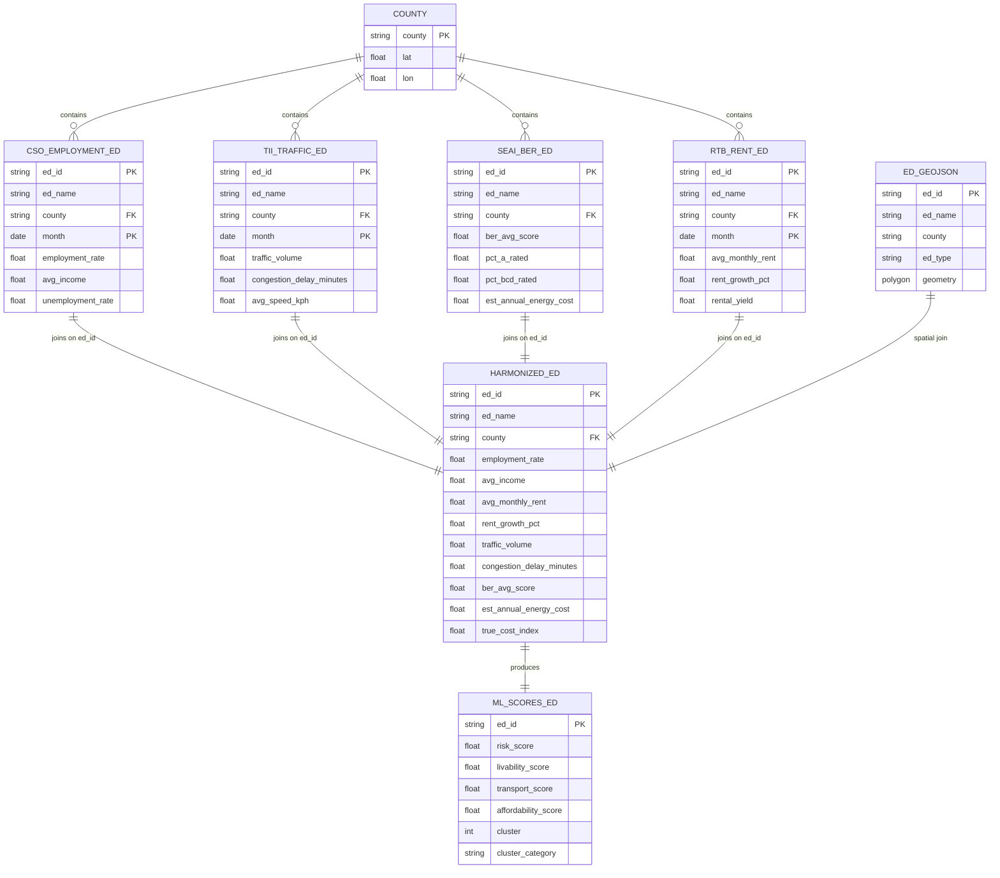
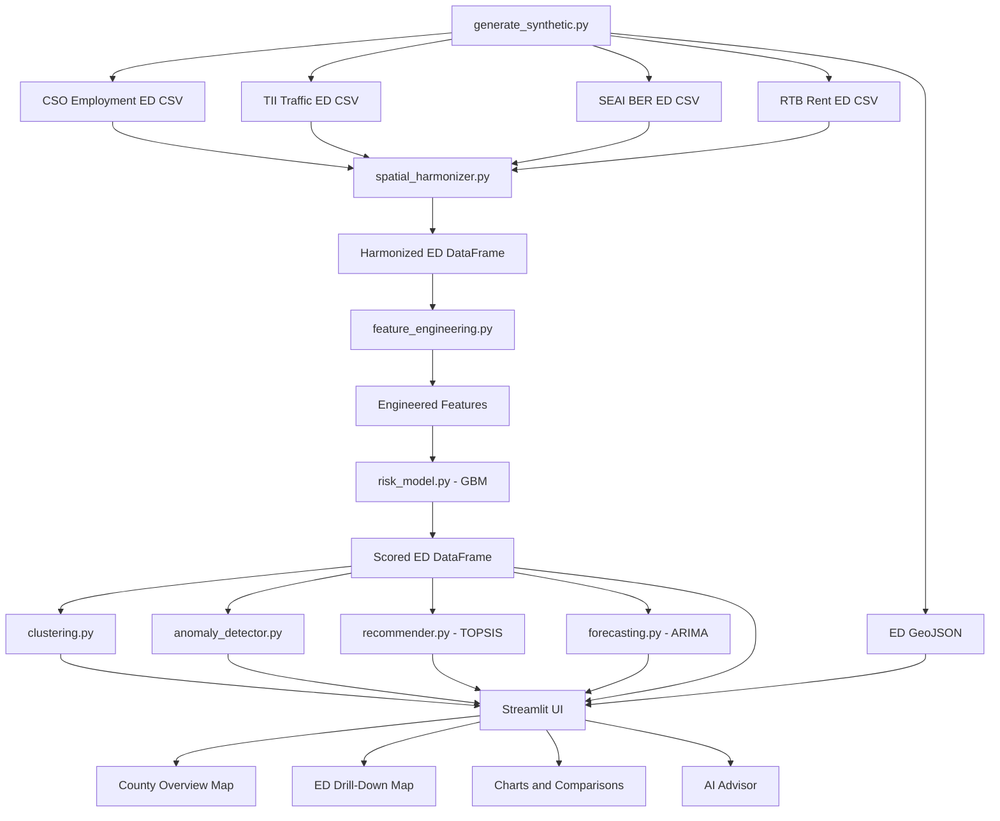

# Léarslán V3 — Electoral Division Dataset Schema

## Overview

Léarslán V3 operates at two spatial granularities:
- **County Level** (26 rows) — backward-compatible, used for national overview
- **Electoral Division Level** (~260 rows) — hyper-local, used for within-county drill-down

The user selects between these levels via the sidebar toggle. County-level data remains the default; ED-level data provides fine-grained analysis within a selected county.

---

## Primary Key: `ed_id`

Each Electoral Division is identified by a unique `ed_id` string generated from the county prefix and ED name:
```
Format: {COUNTY_PREFIX}_{normalized_name}
Example: DUB_rathmines_east_a, COR_cork_city_south_central
```

---

## Dataset 1: CSO Employment (ED Level)

**File:** `data/cso_employment_ed.csv`  
**Rows:** ~3,120 (260 EDs × 12 months)  
**Source:** Central Statistics Office (synthetic)

| Column | Type | Description |
|--------|------|-------------|
| `ed_id` | `str` | Electoral Division unique identifier |
| `ed_name` | `str` | Human-readable ED name |
| `county` | `str` | Parent county name |
| `month` | `date` | Observation month (YYYY-MM-DD) |
| `employment_rate` | `float` | Employment rate (0.0–1.0) |
| `avg_income` | `float` | Average annual income (€) |
| `unemployment_rate` | `float` | Unemployment rate (0.0–1.0) |

---

## Dataset 2: TII Traffic (ED Level)

**File:** `data/tii_traffic_ed.csv`  
**Rows:** ~3,120 (260 EDs × 12 months)  
**Source:** Transport Infrastructure Ireland (synthetic)

| Column | Type | Description |
|--------|------|-------------|
| `ed_id` | `str` | Electoral Division unique identifier |
| `ed_name` | `str` | Human-readable ED name |
| `county` | `str` | Parent county name |
| `month` | `date` | Observation month |
| `traffic_volume` | `float` | Average daily vehicle count |
| `congestion_delay_minutes` | `float` | Average commute delay (minutes) |
| `avg_speed_kph` | `float` | Average traffic speed (km/h) |

---

## Dataset 3: SEAI BER Energy (ED Level)

**File:** `data/seai_ber_ed.csv`  
**Rows:** ~260 (one per ED, no time series)  
**Source:** Sustainable Energy Authority of Ireland (synthetic)

| Column | Type | Description |
|--------|------|-------------|
| `ed_id` | `str` | Electoral Division unique identifier |
| `ed_name` | `str` | Human-readable ED name |
| `county` | `str` | Parent county name |
| `ber_avg_score` | `float` | Average BER rating (1.0–7.0, lower = better) |
| `pct_a_rated` | `float` | % of dwellings rated A |
| `pct_bcd_rated` | `float` | % of dwellings rated B/C/D |
| `est_annual_energy_cost` | `float` | Estimated annual energy cost (€) |

---

## Dataset 4: RTB Rent (ED Level)

**File:** `data/rtb_rent_ed.csv`  
**Rows:** ~3,120 (260 EDs × 12 months)  
**Source:** Residential Tenancies Board (synthetic)

| Column | Type | Description |
|--------|------|-------------|
| `ed_id` | `str` | Electoral Division unique identifier |
| `ed_name` | `str` | Human-readable ED name |
| `county` | `str` | Parent county name |
| `month` | `date` | Observation month |
| `avg_monthly_rent` | `float` | Average monthly rent (€) |
| `rent_growth_pct` | `float` | Year-over-year rent growth (decimal) |
| `rental_yield` | `float` | Gross rental yield (%) |

---

## Dataset 5: Harmonized ED Features (in-memory)

Created by `spatial_harmonizer.py::harmonize_ed_data()` — joins latest snapshot of all 4 datasets on `ed_id`.

| Column | Type | Source | Description |
|--------|------|--------|-------------|
| `ed_id` | `str` | Key | Primary spatial identifier |
| `ed_name` | `str` | All | Human-readable ED name |
| `county` | `str` | All | Parent county for grouping |
| `employment_rate` | `float` | CSO | Latest employment rate |
| `avg_income` | `float` | CSO | Latest average income |
| `avg_monthly_rent` | `float` | RTB | Latest average rent |
| `rent_growth_pct` | `float` | RTB | Latest rent growth |
| `traffic_volume` | `float` | TII | Latest traffic volume |
| `congestion_delay_minutes` | `float` | TII | Latest commute delay |
| `ber_avg_score` | `float` | SEAI | BER energy rating |
| `est_annual_energy_cost` | `float` | SEAI | Annual energy cost |

### Derived Features (feature_engineering.py)

| Column | Formula | Description |
|--------|---------|-------------|
| `est_monthly_commute_cost` | `congestion × 2 × 22` | Estimated monthly commute cost |
| `commute_to_rent_ratio` | `commute_cost / rent` | Commute burden ratio |
| `energy_tax` | `rent + monthly_energy` | True housing cost |
| `true_cost_index` | Composite 0–100 | Normalized total cost |

### ML-Predicted Scores (risk_model.py)

| Column | Model | Description |
|--------|-------|-------------|
| `risk_score` | GBM | Risk assessment (0–100) |
| `livability_score` | GBM | Livability rating (0–100) |
| `transport_score` | GBM | Transport connectivity (0–100) |
| `affordability_score` | GBM | Affordability rating (0–100) |
| `cluster` | KMeans | Cluster assignment |
| `cluster_category` | Heuristic | Semantic cluster label |

---

## Dataset 6: ED GeoJSON

**File:** `data/ireland_eds.geojson`  
**Features:** ~260 polygons

| Property | Type | Description |
|----------|------|-------------|
| `ed_id` | `str` | Matches CSV `ed_id` |
| `ed_name` | `str` | Electoral Division name |
| `county` | `str` | Parent county |
| `ed_type` | `str` | `urban_core`, `suburban`, `town`, `village`, `rural` |
| `geometry` | `Polygon` | Synthetic ED boundary |

---

## Schema Diagram



---

## Data Flow



---

## ED Type Variance Modifiers

Each ED's baseline data is derived from its parent county's baseline, adjusted by the ED's type:

| ED Type | Rent | Income | Employment | Traffic | BER |
|---------|------|--------|------------|---------|-----|
| `urban_core` | +30% | +20% | +5% | +40% | -15% |
| `suburban` | +10% | +10% | +2% | +20% | -5% |
| `town` | 0% | 0% | 0% | 0% | 0% |
| `village` | -15% | -10% | -3% | -20% | +10% |
| `rural` | -30% | -20% | -7% | -50% | +20% |

This creates realistic intra-county variance while maintaining consistent county-level aggregates.

---

## Hierarchical Navigation

The dashboard supports a hierarchical navigation model:

1. **Default:** County-level overview (26 counties)
2. **Toggle:** Switch to Electoral Division level via sidebar
3. **Drill-down:** Select a county → see all its EDs
4. **Compare:** Duel two EDs within or across counties
5. **Aggregate:** Roll ED data back to county level for summary views
