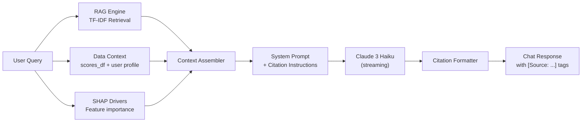
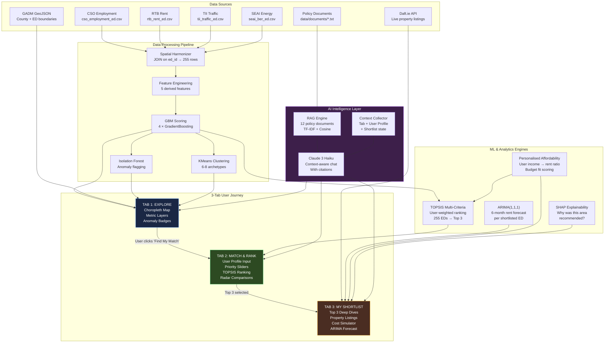

# Léarslán V4 — Product Vision & Technical Scoping Document

**Version:** 4.0 | **Author:** Senior AI Architect & Team Lead | **Date:** April 2026
**Product Name:** Léarslán — "Where in Ireland Should You Live?"
**Classification:** Internal — Product Scoping & Engineering Specification

---

## 1. Product Vision

Léarslán V4 is a **single-purpose, opinionated relocation intelligence engine** for Ireland. It replaces the 8-tab analytics dashboard with a **3-step guided journey** that takes a user from zero knowledge to a personalised shortlist with real property listings in under 90 seconds.

**The metaphor:** Think of it as a "Tinder for Irish neighbourhoods" — swipe through data, set your deal-breakers, and get matched to the 3 best areas to live.

### 1.1 User Persona

> *"I'm relocating to Ireland (or within Ireland). I earn €X per month, I need schools/transport/quiet countryside. Where should I live, and what's actually available to rent or buy there?"*

### 1.2 The 3-Tab Journey

```
┌─────────────────┐    ┌──────────────────────┐    ┌────────────────────────┐
│  TAB 1: EXPLORE  │ →  │  TAB 2: MATCH & RANK  │ →  │  TAB 3: MY SHORTLIST   │
│                 │    │                      │    │                        │
│  Interactive    │    │  Dynamic filters     │    │  3 best-matched areas  │
│  Ireland map    │    │  Priority sliders    │    │  Live property listings│
│  ED-level stats │    │  TOPSIS ranking      │    │  Cost breakdown        │
│  Heatmap layers │    │  Side-by-side cards  │    │  AI Advisor chat       │
│  Quick insights │    │  Area comparison     │    │  "Apply" / "Save"      │
└─────────────────┘    └──────────────────────┘    └────────────────────────┘

        🤖 AI Advisor — Persistent floating panel across all 3 tabs
```

---

## 2. Available Data Assets

Based on the `data/real_data/` directory and `dataset_schema_ed.md`, these are the concrete data columns we can leverage:

### 2.1 Raw Data Inventory (255 Electoral Divisions × 26 Counties)

| Dataset | File | Key Columns | Temporal | Real vs Synthetic |
|:--------|:-----|:------------|:---------|:------------------|
| **CSO Employment** | `cso_employment_ed.csv` | `employment_rate`, `avg_income`, `unemployment_rate` | Monthly (12 months) | Real-Proxy |
| **RTB Rent** | `rtb_rent_ed.csv` | `avg_monthly_rent`, `rent_growth_pct`, `rental_yield` | Monthly (12 months) | Real-Proxy |
| **TII Traffic** | `tii_traffic_ed.csv` | `traffic_volume`, `congestion_delay_minutes`, `avg_speed_kph` | Monthly (12 months) | Synthetic |
| **SEAI Energy** | `seai_ber_ed.csv` | `ber_avg_score`, `pct_a_rated`, `est_annual_energy_cost` | Static snapshot | Synthetic |
| **County GeoJSON** | `ireland_counties.geojson` | 26 county polygons | — | 100% Real (GADM) |
| **ED GeoJSON** | `ireland_eds.geojson` | 255 ED polygons + `ed_type` | — | Synthetic boundaries |

**Data ranges observed:**
- Rent: €510 – €3,394/month across EDs
- Income: varies by county (€30k – €59k)
- ED types: 44 urban_core, 37 suburban, 57 town, 63 village, 54 rural
- Total spatial units: 255 EDs across 26 counties

### 2.2 Derived Features Achievable

From the raw columns, `feature_engineering.py` can compute:

| Derived Feature | Formula | User Value |
|:----------------|:--------|:-----------|
| `affordability_index` | `(income / 12) / rent` | "Can I afford to live here on my salary?" |
| `rent_to_income_pct` | `(rent × 12) / income × 100` | "What % of my income goes to rent?" |
| `commute_cost` | `congestion_delay × 2 × 22` | "How much does commuting cost me monthly?" |
| `true_cost_index` | `0.5×Norm(rent) + 0.25×Norm(energy) + 0.25×Norm(commute)` | "What's the REAL cost of living here?" |
| `energy_tax` | `rent + (energy_cost / 12)` | "What's my true monthly housing bill?" |

### 2.3 ML-Predicted Scores Achievable

| Score | Algorithm | Interpretation |
|:------|:----------|:---------------|
| `risk_score` | GBM (100 trees, depth 4) | 0–100, higher = more volatile/risky |
| `livability_score` | GBM | 0–100, higher = better quality of life |
| `transport_score` | GBM | 0–100, higher = better connectivity |
| `affordability_score` | GBM | 0–100, higher = more affordable |
| `cluster` | KMeans (6–8 clusters) | Neighbourhood archetype assignment |
| `cluster_category` | Heuristic | "Premium Urban", "Hidden Gems", "Budget Rural", etc. |

---

## 3. Tab 1: EXPLORE — Interactive Ireland Intelligence Map

### 3.1 Purpose

The landing page. The user sees a **beautiful, data-rich map of Ireland** at the Electoral Division level. Before they configure anything, they can visually absorb the landscape of where is expensive, where is affordable, where has good transport, etc.

### 3.2 Features

| Feature | Description | Data Source |
|:--------|:------------|:------------|
| **Choropleth Map** | Folium/Plotly map of Ireland coloured by a selectable metric | `ireland_eds.geojson` + scores_df |
| **Metric Layer Switcher** | Toggle between: Affordability, Risk, Livability, Transport, Rent, Income | All 4 GBM scores + raw features |
| **ED Hover Cards** | Mouse over any ED to see a tooltip with key stats | scores_df row |
| **County Aggregation Bar** | Horizontal bar chart ranking all 26 counties by selected metric | `aggregate_to_county()` |
| **"Pulse" Anomaly Badges** | Flashing indicators on EDs flagged as anomalous by Isolation Forest | `anomaly_detector.py` |
| **Quick Insight Panel** | AI-generated 2-sentence summary of the national landscape | `llm_generator.py` |
| **Cluster Legend** | Colour-coded legend showing the 6–8 neighbourhood archetypes | `clustering.py` |

### 3.3 User Interactions

```
User arrives → sees Ireland map coloured by "Affordability Score"
            → toggles to "Risk Score" → Dublin lights up red
            → hovers over "Rathmines East A" → sees tooltip:
                "Rent: €3,058 | Risk: 82 | Livability: 38 | Commute: 40 min"
            → clicks "Find My Match →" button → navigates to Tab 2
```

### 3.4 ML Algorithms Used

| Algorithm | Purpose | Config |
|:----------|:--------|:-------|
| **GBM × 4** | Generate the 4 score layers (risk, livability, transport, affordability) | 100 trees, depth 4, lr 0.1 |
| **KMeans** | Assign each ED to a neighbourhood archetype cluster | k=6–8, StandardScaler |
| **Isolation Forest** | Flag anomalous EDs (rent spikes, affordability crises) | contamination=0.05 |

---

## 4. Tab 2: MATCH & RANK — Personalised Area Matchmaker

### 4.1 Purpose

The **core differentiator**. The user inputs their personal profile, and the system runs a TOPSIS multi-criteria decision analysis to rank all 255 Electoral Divisions against their specific needs. This is not a simple filter — it's a **weighted optimisation** that balances competing priorities.

### 4.2 User Input Panel (Left Column)

#### 4.2.1 Financial Profile

| Input | Widget | Range | Maps To |
|:------|:-------|:------|:--------|
| **Monthly Take-Home Income** | `st.number_input` | €1,000 – €15,000 | Budget for affordability calc |
| **Max Rent Budget** | `st.slider` | €500 – €5,000 | Hard filter (eliminate EDs above this) |
| **Savings for Deposit** | `st.number_input` | €0 – €100,000 | Used for "Buy" mode property matching |

#### 4.2.2 Lifestyle Preferences (Dynamic Filters)

| Input | Widget | Options | Effect on Ranking |
|:------|:-------|:--------|:------------------|
| **Area Type** | `st.multiselect` | Urban Core, Suburban, Town, Village, Rural | Hard filter on `ed_type` |
| **Needs Schools Nearby** | `st.toggle` | Yes / No | Boosts `livability_score` weight by +15 |
| **Needs Good Transport** | `st.toggle` | Yes / No | Boosts `transport_score` weight by +20 |
| **Needs Low Congestion** | `st.toggle` | Yes / No | Boosts congestion penalty by +15 |
| **Energy Efficiency Matters** | `st.toggle` | Yes / No | Boosts BER/energy weight by +10 |
| **Work Mode** | `st.radio` | Remote / Hybrid / Office | Adjusts transport vs livability weights |
| **Household Size** | `st.slider` | 1 – 6 | Scales rent by bedroom multiplier |

#### 4.2.3 Priority Sliders (TOPSIS Weights)

These are the **key innovation** — the user directly controls the TOPSIS weight vector:

| Slider | Label | Range | Default | TOPSIS Criterion |
|:-------|:------|:------|:--------|:-----------------|
| 🏠 | **Affordability** | 0 – 100 | 70 | `affordability_score` (benefit) |
| 🌿 | **Quality of Life** | 0 – 100 | 50 | `livability_score` (benefit) |
| 🚗 | **Transport & Commute** | 0 – 100 | 40 | `transport_score` (benefit) |
| ⚡ | **Energy Efficiency** | 0 – 100 | 30 | `(1 - ber_avg_score)` (benefit) |
| 📈 | **Job Market Strength** | 0 – 100 | 50 | `employment_rate` (benefit) |
| 🛡️ | **Stability (Low Risk)** | 0 – 100 | 40 | `risk_score` (cost — inverted) |

**Weight Normalisation:**

```
raw_weights = [affordability, quality, transport, energy, jobs, stability]
w_i = max(raw_i, 1) / sum(max(raw_j, 1) for j in raw_weights)
```

### 4.3 Results Panel (Right Column)

After the user clicks **"Find My Match"**, the system displays:

#### 4.3.1 Ranked Cards View

The top 10 matching EDs rendered as cards:

```
┌─────────────────────────────────────────────────┐
│  🥇 #1 — Castletroy, Limerick                  │
│  Match Score: 91.3/100          🏘️ Suburban     │
│                                                 │
│  Rent: €1,344  │  Income: €43,200              │
│  Risk: 22/100  │  Livability: 78/100            │
│  Transport: 65  │  BER: 3.1 (B-rated)          │
│                                                 │
│  "Your rent would be 31% of income — safe."     │
│                                                 │
│  [⭐ Shortlist]  [📊 Compare]  [🤖 Ask AI]     │
└─────────────────────────────────────────────────┘
```

#### 4.3.2 Comparison Radar Chart

When user selects 2–3 areas with "Compare", show a Plotly radar chart overlaying their scores:

```
Axes: Affordability, Livability, Transport, Energy, Employment, Stability
Areas: Overlaid polygons with distinct colours
```

#### 4.3.3 Budget Fit Traffic Light

For each matched area, compute:

```
est_monthly_cost = (rent × bedroom_multiplier)
                 + (energy_cost / 12 × household_scale)
                 + (commute_cost if not remote else €80)

remaining = income - est_monthly_cost

   remaining > €1,000     → 🟢 "Comfortable"
   remaining > €300       → 🟡 "Manageable"
   remaining > €0         → 🟠 "Tight"
   remaining ≤ €0         → 🔴 "Over Budget"
```

### 4.4 ML Algorithms Used

| Algorithm | Purpose | Detail |
|:----------|:--------|:-------|
| **TOPSIS** | Rank 255 EDs by closeness to user's ideal solution | Vector-normalized, weighted by user sliders |
| **Dynamic Weight Injection** | Toggle-driven weight modifiers (schools → livability +15) | Applied before TOPSIS normalisation |
| **Personalised Affordability** | Recompute `affordability_index` using *user's actual income* instead of county average | `(user_income / 12) / ed_rent` |

#### 4.4.1 Enhanced TOPSIS for V4

The V3 TOPSIS uses 8 static criteria. V4 extends this to a **user-controlled 6-criterion model** with dynamic weight injection:

```
Decision Matrix D (255 rows × 6 criteria):

  D = [ affordability_score_i, livability_score_i, transport_score_i,
        (1 - ber_normalized_i), employment_rate_i, (100 - risk_score_i) ]

Weight Vector W (user-controlled):
  W = normalize( [slider_afford, slider_quality, slider_transport,
                   slider_energy, slider_jobs, slider_stability] )

Hard Filters (applied BEFORE TOPSIS):
  - avg_monthly_rent ≤ max_rent_budget
  - ed_type ∈ selected_area_types
  - if needs_good_transport: transport_score ≥ 40
  - if needs_low_congestion: congestion_delay ≤ 15 min

TOPSIS Steps:
  1. Filter D → D' (surviving EDs after hard filters)
  2. Vector normalize: r_ij = x_ij / √(Σ x_ij²)
  3. Weight: v_ij = w_j × r_ij
  4. Ideal A+ = max(v_j) for each criterion (all are benefit)
  5. Anti-ideal A- = min(v_j) for each criterion
  6. Distance: D_i+ = √(Σ(v_ij − A_j+)²),  D_i- = √(Σ(v_ij − A_j-)²)
  7. Closeness: C_i = D_i- / (D_i+ + D_i-) × 100
  8. Rank by C_i descending → Top 3 go to shortlist
```

---

## 5. Tab 3: MY SHORTLIST — Deep Dive & Property Listings

### 5.1 Purpose

The user's **top 3 matched areas** (from TOPSIS) are presented as deep-dive profiles with real property listings, cost simulators, rent forecasts, and the AI advisor providing contextual guidance.

### 5.2 Layout: Triptych Cards

Three side-by-side expandable cards, one per shortlisted area:

```
┌──────────────────┐  ┌──────────────────┐  ┌──────────────────┐
│  🥇 CASTLETROY   │  │  🥈 MAYNOOTH     │  │  🥉 ENNIS URBAN  │
│  Limerick        │  │  Kildare         │  │  Clare            │
│  Match: 91.3     │  │  Match: 87.1     │  │  Match: 84.6      │
│  ──────────────  │  │  ──────────────  │  │  ──────────────   │
│  📊 Score Card   │  │  📊 Score Card   │  │  📊 Score Card    │
│  🏠 Listings     │  │  🏠 Listings     │  │  🏠 Listings      │
│  💰 Cost Sim     │  │  💰 Cost Sim     │  │  💰 Cost Sim      │
│  📈 Forecast     │  │  📈 Forecast     │  │  📈 Forecast      │
│  🤖 Ask AI       │  │  🤖 Ask AI       │  │  🤖 Ask AI        │
└──────────────────┘  └──────────────────┘  └──────────────────┘
```

### 5.3 Per-Area Deep Dive Components

#### 5.3.1 Score Card (Always Visible)

| Metric | Display | Data Column |
|:-------|:--------|:------------|
| Match Score | `91.3 / 100` | TOPSIS closeness |
| Monthly Rent | `€1,344` | `avg_monthly_rent` |
| Your Rent-to-Income | `31%` | `(ed_rent × 12) / user_income × 100` |
| Employment Rate | `73.5%` | `employment_rate` |
| Commute Delay | `14 min` | `congestion_delay_minutes` |
| Energy Rating | `B2 (3.1)` | `ber_avg_score` |
| Area Type | `🏘️ Suburban` | `ed_type` from GeoJSON |
| Cluster | `Hidden Gem 💎` | `cluster_category` |

#### 5.3.2 Property Listings (Expandable)

Live Daft.ie integration via `daft_client.py`:

```
┌─────────────────────────────────────────────┐
│  🏠 Available Properties in Castletroy      │
│                                             │
│  2-bed Apartment — €1,350/mo               │
│  3-bed Semi-D    — €1,600/mo               │ 
│  1-bed Studio    — €1,050/mo               │
│  [View on Daft.ie →]                        │
│                                             │
│  Showing 12 listings | Last updated: 15m ago│
└─────────────────────────────────────────────┘
```

#### 5.3.3 Monthly Cost Simulator (Expandable)

Personalised to the user's actual inputs:

```
Monthly Cost Breakdown — Castletroy

  🏠 Rent (2-bed)           €1,344
  ⚡ Energy (household×1.15)  €201
  🚗 Commute (22 days)       €616
  ─────────────────────────
  📊 Total Monthly Cost     €2,161
  💰 Your Income            €3,500
  ✅ Remaining              €1,339   🟢 Comfortable
```

#### 5.3.4 Rent Forecast (Expandable)

ARIMA(1,1,1) 6-month projection:

```
Plotly line chart:
  - Historical: 12 months solid line
  - Forecast: 6 months dashed line with 80% CI shaded band
  - Annotation: "Expected rent in 6 months: €1,420 (+5.7%)"
```

#### 5.3.5 AI Advisor (Per-Area Context)

The floating AI advisor, when invoked from a shortlist card, receives the specific area context:

```
System prompt injection:
  "The user has shortlisted Castletroy (Limerick) as their #1 match.
   Their income is €3,500/mo, household size 2, hybrid worker.
   Match score: 91.3. Rent-to-income: 31%. Budget fit: Comfortable.
   They can ask about schools, safety, local amenities, or compare
   with their #2 pick (Maynooth)."
```

### 5.4 Bonus: User-Added Areas

Below the top 3, a **"+ Add an area I'm interested in"** selector lets the user manually add any ED to their shortlist for comparison. This generates the same deep-dive card on the fly.

### 5.5 ML Algorithms Used

| Algorithm | Purpose |
|:----------|:--------|
| **ARIMA(1,1,1)** | 6-month rent forecast per shortlisted ED |
| **Personalised Affordability** | Recomputed with user's actual income |
| **GBM Scores** | Pre-computed risk/livability/transport/affordability for each ED |
| **SHAP TreeExplainer** | "Why was this area recommended?" — top 3 drivers per shortlisted ED |
| **RAG + Claude 3 Haiku** | Contextual chat per shortlisted area |

---

## 6. AI Advisor — Omnipresent Intelligence Layer

### 6.1 Presence Model

The AI Advisor is a **persistent floating panel** (sidebar expander) visible on all 3 tabs. It automatically adapts its context based on the user's current tab and interactions.

### 6.2 Context Injection by Tab

| Tab | Context Injected into System Prompt |
|:----|:------------------------------------|
| **Explore** | National landscape summary, anomaly alerts, selected metric interpretation |
| **Match & Rank** | User's full profile (income, priorities, filters), top 10 matches with scores, "why did X rank higher than Y?" |
| **My Shortlist** | Deep data for the 3 shortlisted areas, property listings, cost breakdown, forecast projections, comparison between the 3 |

### 6.3 Citation Architecture



---

## 7. Complete System Architecture



---

## 8. ML Algorithm Summary — Complete Reference

| # | Algorithm | Library | Use Case | Input | Output | Config |
|:--|:----------|:--------|:---------|:------|:-------|:-------|
| 1 | **GBM (Risk)** | sklearn | Score how volatile/risky an area is | 8–15 features | 0–100 score | 100 trees, depth 4, lr 0.1 |
| 2 | **GBM (Livability)** | sklearn | Score quality of life | Same feature matrix | 0–100 score | Same config |
| 3 | **GBM (Transport)** | sklearn | Score transport connectivity | Same feature matrix | 0–100 score | Same config |
| 4 | **GBM (Affordability)** | sklearn | Score housing affordability | Same feature matrix | 0–100 score | Same config |
| 5 | **KMeans** | sklearn | Group EDs into neighbourhood archetypes | 6 features, StandardScaled | Cluster ID (0–7) | k=6–8, n_init=10 |
| 6 | **UMAP** | umap-learn | 2D projection for cluster scatter plot | Same 6 features | (x, y) coords | n_neighbors=15, min_dist=0.3 |
| 7 | **Isolation Forest** | sklearn | Flag anomalous EDs (rent spikes, crises) | 4 features | anomaly label (-1/1) | contamination=0.05 |
| 8 | **TOPSIS** | Custom | Rank 255 EDs by personalised user preferences | 6 criteria + weight vector | Closeness score 0–100 | Vector normalised |
| 9 | **ARIMA(1,1,1)** | statsmodels | 6-month rent / metric forecast | 12-month time series | Forecast + 80% CI | order=(1,1,1) |
| 10 | **SHAP TreeExplainer** | shap | Explain why an area scored high/low | GBM model + feature vector | Per-feature contributions | Exact tree SHAP |
| 11 | **TF-IDF + Cosine** | sklearn | RAG document retrieval for AI advisor | User query + policy docs | Top-3 relevant chunks | stop_words='english' |
| 12 | **Linear Regression** | numpy | ARIMA fallback forecasting | Historical time series | Trendline + ±1.5σ CI | polyfit degree=1 |

---

## 9. Feature-to-Data Traceability Matrix

Every user-facing feature can be traced to a specific data column and ML output:

| User-Facing Feature | Tab | Data Columns Used | ML Output Used |
|:---------------------|:----|:------------------|:---------------|
| Map heatmap colour | 1 | `ireland_eds.geojson` | GBM scores (4 options) |
| ED hover tooltip | 1 | `avg_monthly_rent`, `employment_rate`, `congestion_delay_minutes` | `risk_score`, `livability_score` |
| Anomaly pulse badges | 1 | `avg_monthly_rent`, `rent_growth_pct`, `risk_score` | Isolation Forest labels |
| Cluster legend | 1 | `avg_monthly_rent`, `risk_score`, `livability_score`, `affordability_score`, `transport_score`, `employment_rate` | KMeans cluster_category |
| Hard filter: max rent | 2 | `avg_monthly_rent` | — |
| Hard filter: area type | 2 | `ed_type` (from GeoJSON) | — |
| Priority slider weights | 2 | — | TOPSIS weight vector W |
| Match score | 2 | All 6 TOPSIS criteria columns | TOPSIS closeness C_i |
| Budget fit traffic light | 2,3 | `avg_monthly_rent`, `est_annual_energy_cost`, `congestion_delay_minutes` | Personalised affordability |
| Rent-to-income % (personalised) | 2,3 | `avg_monthly_rent` + user's income | Custom calculation |
| Property listings | 3 | Daft.ie live API | — |
| Rent forecast chart | 3 | `rtb_rent_ed.csv` (12-month series) | ARIMA(1,1,1) |
| SHAP explanation | 3 | GBM feature importances | SHAP TreeExplainer |
| AI advisor answers | 1,2,3 | All scores + user profile + `data/documents/*.txt` | RAG + Claude 3 Haiku |

---

## 10. Non-Functional Requirements

| Requirement | Target | How |
|:------------|:-------|:----|
| **Cold start time** | < 5 seconds | `@st.cache_data` on all ML training; GBM trains in <500ms on 255 rows |
| **Tab switch latency** | < 200ms | Pre-computed scores cached in `st.session_state` |
| **TOPSIS recalculation** | < 100ms | Pure numpy on 255×6 matrix |
| **ARIMA forecast** | < 1 second per area | Only runs for 3 shortlisted areas, not all 255 |
| **Daft.ie listings** | Cached 15 min TTL | `@st.cache_data(ttl=900)` |
| **Mobile responsive** | Streamlit `layout="wide"` + CSS breakpoints | `ui/styles.py` |

---

## 11. Implementation Phasing

| Phase | Scope | Duration | Dependencies |
|:------|:------|:---------|:-------------|
| **P1: Core Data + Scoring** | Harmonise data → Feature Eng → GBM training → 4 scores + clusters | Day 1 | `real_data/` CSV files |
| **P2: Tab 1 — Explore** | Choropleth map, metric switcher, hover cards, anomaly badges | Day 2 | P1 outputs + GeoJSON |
| **P3: Tab 2 — Match** | User input panel, slider weights, TOPSIS engine, ranked cards, radar chart | Days 3–4 | P1 outputs |
| **P4: Tab 3 — Shortlist** | Top-3 deep dives, cost simulator, ARIMA forecast, Daft.ie integration | Days 5–6 | P3 output (top 3 EDs) |
| **P5: AI Advisor** | RAG corpus expansion, floating widget, per-tab context, citations | Days 7–8 | Independent (parallel with P2–P4) |
| **P6: Polish & Integration** | UI polish, mobile responsive, edge case handling, end-to-end testing | Day 9 | All phases complete |

---

## 12. Risk Register

| Risk | Impact | Mitigation |
|:-----|:-------|:-----------|
| Daft.ie API rate limiting or downtime | Tab 3 property listings fail | Graceful fallback: "No live listings available. Based on our data, expect rents around €X in this area." |
| ARIMA convergence failure on short ED series | Forecast tab shows empty chart | Linear regression fallback with ±1.5σ band (already implemented) |
| User sets all priority sliders to 0 | TOPSIS division by zero | `max(slider, 1)` before normalisation (already in formula) |
| < 3 EDs pass hard filters | Shortlist tab has fewer than 3 cards | Show available matches with message: "Only N areas match your strict filters. Consider relaxing Area Type or Budget." |
| ANTHROPIC_API_KEY missing | AI Advisor returns error | Template-based fallback in `llm_generator.py` (already implemented) |
