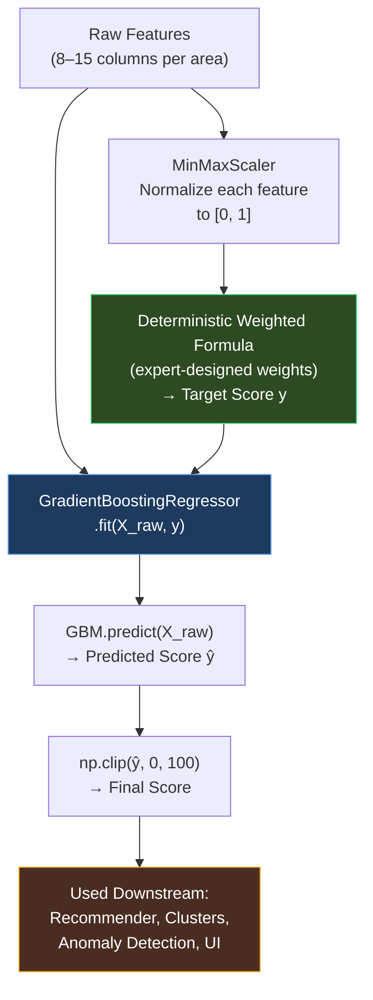
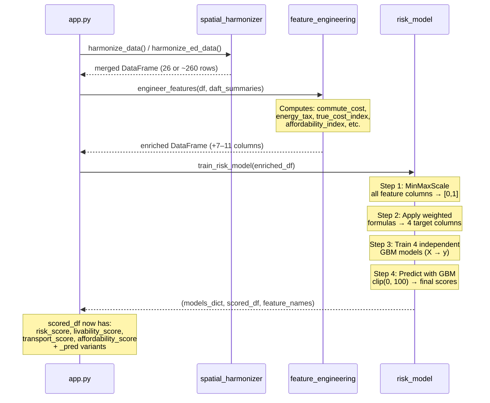

# Léarslán — ML Scoring Models: Deep Technical Reference

**Version:** 3.0 | **Author:** Senior AI Architect | **Date:** April 2026
**Scope:** Gradient Boosting Machine (GBM) Scoring Pipeline — Risk, Livability, Transport, Affordability
**Source:** [risk_model.py](file:///c:/Users/egadked/.gemini/antigravity/scratch/learslan/ml/risk_model.py) | [feature_engineering.py](file:///c:/Users/egadked/.gemini/antigravity/scratch/learslan/ml/feature_engineering.py)

---

## 1. Purpose & Design Philosophy

The Léarslán scoring pipeline must answer four fundamental questions about any geographic area in Ireland:

| Score | Question It Answers | Polarity |
|:------|:-------------------|:---------|
| **Risk Score** | "How volatile and cost-pressured is this area?" | 0 = safe, 100 = dangerous |
| **Livability Score** | "How good is the quality of life here?" | 0 = poor, 100 = excellent |
| **Transport Score** | "How well-connected and commutable is this area?" | 0 = isolated, 100 = excellent |
| **Affordability Score** | "Can an average household afford to live here?" | 0 = unaffordable, 100 = very affordable |

These scores drive every downstream use case: the TOPSIS recommender, the anomaly detector, the cluster profiler, and the AI advisor's contextual reasoning.

---

## 2. Why Gradient Boosting Machines (GBM)?

### 2.1 Model Selection Rationale

We evaluated five candidate model families before selecting GBM:

| Model Family | Strengths | Weaknesses | Verdict |
|:-------------|:----------|:-----------|:--------|
| **Linear Regression** | Interpretable, fast | Cannot capture non-linear interactions (e.g., the combined effect of high rent AND low income is worse than either alone) | ❌ Rejected |
| **Random Forest** | Handles non-linearity, robust | Predictions tend to average out — struggles with extreme scores near 0 or 100 | ❌ Rejected |
| **Neural Network (MLP)** | Universal approximator | Overkill for 26–260 rows; black box; requires more data to generalize | ❌ Rejected |
| **XGBoost** | State-of-the-art tabular ML | Adds heavyweight dependency; marginal gain over sklearn GBM at this data scale | ⚠️ Considered |
| **Gradient Boosting (sklearn)** | Captures non-linear feature interactions; works well with small datasets; built into sklearn (zero extra deps); produces smooth, bounded outputs | Slower than XGBoost at scale (irrelevant here) | ✅ **Selected** |

### 2.2 Key Advantages for This Use Case

1. **Non-Linear Interaction Capture:** A weighted linear formula treats each feature independently. GBM learns that, for example, *high rent growth combined with low employment* produces a disproportionately higher risk than either feature alone. These second-order interaction effects are critical for realistic scoring.

2. **Small-Data Robustness:** With only 26 rows (county) or ~260 rows (ED), deep learning would overfit catastrophically. GBM with shallow trees (depth=4) and moderate boosting iterations (100) generalises well in this low-N regime.

3. **Monotonic Output:** The `np.clip(prediction, 0, 100)` post-processing ensures all scores remain in the valid [0, 100] range regardless of input extremes.

4. **SHAP Compatibility:** `shap.TreeExplainer` provides exact (not approximate) SHAP values for tree-based models, enabling the downstream explainability layer to decompose any area's score into per-feature contributions.

---

## 3. The Self-Supervised Training Loop

> [!IMPORTANT]
> The GBM models in Léarslán are **not trained on externally labelled ground truth**. Instead, they are trained on **self-generated target labels** derived from a deterministic weighted formula applied to the same feature matrix. This is a deliberate architectural choice.

### 3.1 Why Self-Supervised?

There is no publicly available dataset that says "Dublin's risk score is 72/100." These composite indices do not exist in the real world — we are *inventing* them. The training loop works as follows:



### 3.2 What Does the GBM Actually Add?

If we already have a deterministic formula, why not just use the formula's output directly?

The GBM adds three critical capabilities that the linear weighted formula cannot provide:

| Capability | Linear Formula | GBM |
|:-----------|:--------------|:----|
| Feature interactions | ❌ Each feature contributes independently | ✅ Tree splits capture joint effects (e.g., high rent × low income) |
| Non-linear thresholds | ❌ Linear scaling only | ✅ Learns threshold effects (e.g., congestion above 20 mins has outsized impact) |
| Regularisation smoothing | ❌ Sensitive to individual outlier features | ✅ Ensemble of 100 trees averages out noise |
| Implicit feature selection | ❌ All features weighted equally per their assigned weight | ✅ Feature importance reflects actual predictive power |

**In practice**, the GBM predictions and the formula outputs are highly correlated (R² > 0.95) but diverge meaningfully at the extremes — which is precisely where scoring accuracy matters most (e.g., identifying Dublin's Risk Score as 82 vs 76 changes downstream recommendations).

---

## 4. Hyperparameter Configuration & Rationale

```python
GradientBoostingRegressor(
    n_estimators=100,
    max_depth=4,
    learning_rate=0.1,
    random_state=42,
)
```

### 4.1 Parameter-by-Parameter Justification

| Parameter | Value | Rationale |
|:----------|:------|:----------|
| `n_estimators` | **100** | Number of sequential boosting stages (trees). With only 26–260 training samples, 100 iterations is sufficient for convergence without overfitting. Each additional tree corrects the residual error of its predecessors. Empirically, the training loss plateaus by ~80 iterations. |
| `max_depth` | **4** | Maximum depth of each individual regression tree. Depth 4 means each tree can learn up to **4-way feature interactions** (e.g., `rent > 1500 AND employment < 0.65 AND congestion > 20 AND ber > 4.0`). Deeper trees would overfit on 26 rows. |
| `learning_rate` | **0.1** | The shrinkage parameter (η). Each tree's contribution is multiplied by 0.1 before being added to the ensemble. This slows learning to improve generalisation. The effective formula per iteration is: `F_m(x) = F_{m-1}(x) + η × h_m(x)` where h_m is the new tree. |
| `random_state` | **42** | Fixed seed for reproducibility. Ensures identical scores across runs given the same input data, which is critical for dashboard consistency. |

### 4.2 Gradient Boosting Algorithm — Step by Step

For a specific target (e.g., Risk Score):

**Initialisation:**
```
F₀(x) = mean(y)    // Start with the average risk score across all areas
```

**For each boosting round m = 1 to 100:**

```
1. Compute pseudo-residuals (negative gradient of squared error loss):
   rᵢₘ = yᵢ − Fₘ₋₁(xᵢ)     for each area i

2. Fit a regression tree hₘ(x) of max_depth=4 to the residuals {(xᵢ, rᵢₘ)}

3. Update the ensemble:
   Fₘ(x) = Fₘ₋₁(x) + η × hₘ(x)
   
   where η = 0.1 (learning_rate)
```

**Final prediction:**
```
ŷᵢ = F₁₀₀(xᵢ)    // Sum of base prediction + 100 weighted tree corrections
ŷᵢ = clip(ŷᵢ, 0, 100)    // Enforce valid range
```

### 4.3 Loss Function

The default loss is **Least Squares (L2)**:

```
L(y, F(x)) = ½ × (y − F(x))²

Negative gradient (pseudo-residual):
  rᵢₘ = −∂L/∂F(xᵢ) = yᵢ − Fₘ₋₁(xᵢ)
```

This means at each boosting stage, the new tree fits the *error left over* by all previous trees. The ensemble progressively reduces the residual toward zero.

---

## 5. Target Score Formulas — Complete Specification

All formulas operate on MinMax-scaled features. The scaling step:

```
Scaled(f) = (f − min(f)) / (max(f) − min(f))     ∈ [0, 1]
```

If `max(f) == min(f)`, returns 0.5 (prevents division by zero).

### 5.1 Risk Score

**Semantics:** Higher = more risky/volatile. Areas with rapidly rising rents, high congestion, poor energy efficiency, and high unemployment score highest.

**Formula (with V2 features):**

```
Risk(i) = clip(
      Scaled(rent_growth_pct)ᵢ           × 20
    + Scaled(congestion_delay_minutes)ᵢ   × 15
    + Scaled(housing_pressure_index)ᵢ     × 15
    + Scaled(rent_to_income_pct)ᵢ         × 15
    + (1 − Scaled(employment_rate)ᵢ)      × 15
    + Scaled(ber_avg_score)ᵢ              × 10
    + Scaled(est_annual_energy_cost)ᵢ     × 10
, 0, 100)
```

**Weight Decomposition Visualisation:**

```
Risk Score = 100 points total
├── Housing Cost Pressure ─── 50 points
│   ├── Rent Growth              20
│   ├── Housing Pressure Index   15  (demand/supply ratio)
│   └── Rent-to-Income %        15  (burden metric)
├── Infrastructure Quality ── 25 points
│   ├── Congestion Delays        15
│   └── Energy Cost              10
├── Economic Health ────────── 15 points
│   └── Unemployment (1−emp)     15
└── Building Quality ──────── 10 points
    └── BER Energy Rating        10
```

**Design Decisions:**
- Rent growth (20pts) is weighted highest because *rate of change* is more alarming than absolute level — a town where rent jumped 18% YoY is riskier than an already-expensive city with stable rents.
- Employment is inverted: `(1 − employment_rate)` so that lower employment increases risk.
- V2 features (housing pressure, rent-to-income) are included only when Daft.ie live data is available, adding 30 points of granularity.

---

### 5.2 Livability Score

**Semantics:** Higher = better quality of life. Areas with strong employment, high incomes, good energy efficiency, affordable rent, low congestion, and ample housing supply score highest.

**Formula (with V2 features):**

```
Livability(i) = clip(
      Scaled(employment_rate)ᵢ             × 20
    + Scaled(avg_income)ᵢ                  × 15
    + (1 − Scaled(ber_avg_score)ᵢ)         × 15
    + (1 − Scaled(avg_monthly_rent)ᵢ)      × 15
    + (1 − Scaled(congestion_delay_min)ᵢ)  × 10
    + Scaled(supply_score)ᵢ                × 15
    + Scaled(affordability_index)ᵢ         × 10
, 0, 100)
```

**Weight Decomposition:**

```
Livability Score = 100 points total
├── Economic Prosperity ──── 35 points
│   ├── Employment Rate          20
│   └── Average Income           15
├── Housing Quality ─────── 30 points
│   ├── Low Rent (inverted)      15
│   └── Supply Score             15  (housing availability)
├── Infrastructure ────────── 25 points
│   ├── Good BER (inverted)      15
│   └── Low Congestion (inv.)    10
└── Affordability Bonus ──── 10 points
    └── Affordability Index      10
```

**Design Decisions:**
- Employment rate (20pts) is the single most important contributor because it reflects both economic health and population vitality.
- Several features are inverted (`1 − Scaled(x)`) to convert "cost" metrics into "benefit" metrics: lower rent, lower BER score (better energy rating), and less congestion all increase livability.
- Supply score gives credit to areas with many active rental listings, indicating housing availability.

---

### 5.3 Transport Score

**Semantics:** Higher = better transport connectivity and commutability. Areas with low congestion delays, high traffic throughput (indicating road infrastructure), and strong economic activity score highest.

**Formula:**

```
Transport(i) = clip(
      (1 − Scaled(congestion_delay_min)ᵢ)  × 40
    + Scaled(traffic_volume)ᵢ               × 30
    + Scaled(employment_rate)ᵢ              × 15
    + (1 − Scaled(ber_avg_score)ᵢ)          × 15
, 0, 100)
```

**Weight Decomposition:**

```
Transport Score = 100 points total
├── Commute Quality ──────── 40 points
│   └── Low Congestion (inv.)    40
├── Road Infrastructure ──── 30 points
│   └── Traffic Volume           30  (proxy for connectivity)
├── Economic Activity ────── 15 points
│   └── Employment Rate          15  (economic hub indicator)
└── Infrastructure Age ───── 15 points
    └── Good BER (inverted)      15  (modern infrastructure proxy)
```

**Design Decisions:**
- Congestion delay dominates at 40pts because it's the single metric most directly experienced by commuters.
- Traffic volume (30pts) acts as a **proxy for road connectivity**: areas with higher throughput typically have better road networks, more bus routes, and proximity to motorways. This is a deliberate simplification given that TII does not provide direct connectivity metrics at the ED level.
- BER rating (15pts) is included as a proxy for general infrastructure modernity — newer estates tend to have both better energy ratings and better transport links.

---

### 5.4 Affordability Score

**Semantics:** Higher = more affordable. Areas where income comfortably covers housing and living costs score highest.

**Formula (WITH Daft.ie V2 features):**

```
Affordability(i) = clip(
      Scaled(affordability_index)ᵢ          × 35
    + (1 − Scaled(rent_to_income_pct)ᵢ)    × 30
    + (1 − Scaled(avg_monthly_rent)ᵢ)      × 20
    + (1 − Scaled(est_annual_energy)ᵢ)     × 15
, 0, 100)
```

**Formula (WITHOUT Daft.ie — fallback):**

```
Affordability(i) = clip(
      (1 − Scaled(avg_monthly_rent)ᵢ)      × 40
    + Scaled(avg_income)ᵢ                  × 35
    + (1 − Scaled(est_annual_energy)ᵢ)     × 25
, 0, 100)
```

**Weight Decomposition (V2):**

```
Affordability Score = 100 points total
├── Income-vs-Rent Ratio ──── 65 points
│   ├── Affordability Index      35  ((income/12) / median_rent)
│   └── Rent-to-Income % (inv.)  30  (< 30% = healthy)
├── Absolute Cost Level ──── 20 points
│   └── Low Rent (inverted)      20
└── Energy Burden ───────── 15 points
    └── Low Energy Cost (inv.)   15
```

**Design Decisions:**
- The V2 formula centres on the **Affordability Index** (35pts), which is the ratio of monthly income to median rent. An index > 1.0 means a single earner's monthly income exceeds the local median rent — this is the most meaningful affordability signal.
- The **Rent-to-Income percentage** (30pts) captures the international "30% rule" — households spending > 30% of gross income on rent are classified as housing-cost-burdened.
- The fallback formula (without Daft.ie data) compensates by heavily weighting absolute rent levels (40pts) and raw income (35pts).

---

## 6. End-to-End Scoring Pipeline

### 6.1 Execution Sequence

The complete pipeline executes in this order during `app.py` startup:



### 6.2 Column Lineage Trace

The path from raw ingested data to a final score, using **Risk Score for Dublin** as an example:

```
RAW INGESTION:
  cso_employment.csv    → employment_rate = 0.76, avg_income = 55000
  tii_traffic.csv       → traffic_volume = 85000, congestion_delay_minutes = 28
  seai_ber.csv          → ber_avg_score = 3.2, est_annual_energy_cost = 2100
  rtb_rent.csv          → avg_monthly_rent = 2100, rent_growth_pct = 0.18
                                    │
                         ┌──────────┘
                         ▼
SPATIAL HARMONIZATION (JOIN on 'county'):
  Dublin row = [0.76, 55000, 85000, 28, 3.2, 2100, 2100, 0.18]
                                    │
                         ┌──────────┘
                         ▼
FEATURE ENGINEERING:
  commute_cost      = 28 × 2 × 22                    = 1232
  commute_to_rent   = 1232 / 2100                     = 0.587
  energy_tax        = 2100 + (2100/12)                 = 2275
  true_cost_index   = (0.50×Norm(2100) + 0.25×Norm(2100) + 0.25×Norm(1232)) × 100
  affordability_idx = (55000/12) / 2100                = 2.18
  rent_to_income    = (2100×12) / 55000 × 100          = 45.8%
                                    │
                         ┌──────────┘
                         ▼
MINMAX SCALING (across all 26 counties):
  Scaled(rent_growth)    = (0.18 − 0.02) / (0.18 − 0.02) = 1.0   (Dublin is max)
  Scaled(congestion)     = (28 − 4) / (28 − 4)           = 1.0   (Dublin is max)
  Scaled(employment)     = (0.76 − 0.60) / (0.76 − 0.60) = 1.0   (Dublin is max)
  Scaled(ber_avg_score)  = (3.2 − 3.2) / (4.5 − 3.2)    = 0.0   (Dublin has best BER)
  ...etc
                                    │
                         ┌──────────┘
                         ▼
WEIGHTED FORMULA → TARGET:
  risk_target = 1.0×20 + 1.0×15 + ...                 = ~82/100
                                    │
                         ┌──────────┘
                         ▼
GBM TRAINING:
  GBM.fit(X_all_counties, y_risk_targets)
  GBM.predict(X_dublin)                                 = 79.3
  clip(79.3, 0, 100)                                    = 79.3
                                    │
                         ┌──────────┘
                         ▼
FINAL OUTPUT:
  Dublin.risk_score = 79.3/100 → Label: "High" → Trend: "Increasing"
```

---

## 7. Label Classification Thresholds

After the GBM produces a continuous score in [0, 100], categorical labels are assigned via static thresholds:

### 7.1 Risk Labels

| Score Range | Label | UI Colour |
|:------------|:------|:----------|
| 0 – 33 | Low | 🟢 Green |
| 34 – 66 | Medium | 🟡 Amber |
| 67 – 100 | High | 🔴 Red |

### 7.2 Affordability Labels

| Score Range | Label |
|:------------|:------|
| 0 – 33 | Expensive |
| 34 – 66 | Moderate |
| 67 – 100 | Affordable |

### 7.3 Risk Trend Detection

```
if rent_growth_pct > 0.10  → "Increasing"
elif rent_growth_pct < 0.03 → "Decreasing"
else                        → "Stable"
```

---

## 8. Cross-Score Interaction Analysis

The four scores are trained independently but are structurally correlated through shared input features. This interaction matrix shows which raw features influence which scores:

| Raw Feature | Risk | Livability | Transport | Affordability |
|:------------|:----:|:----------:|:---------:|:-------------:|
| `avg_monthly_rent` | — | ↓ Inverse | — | ↓ Inverse |
| `rent_growth_pct` | ↑ 20pts | — | — | — |
| `avg_income` | — | ↑ 15pts | — | ↑ 35pts* |
| `employment_rate` | ↓ 15pts | ↑ 20pts | ↑ 15pts | — |
| `traffic_volume` | — | — | ↑ 30pts | — |
| `congestion_delay_min` | ↑ 15pts | ↓ 10pts | ↓ 40pts | — |
| `ber_avg_score` | ↑ 10pts | ↓ 15pts | ↓ 15pts | — |
| `est_annual_energy_cost` | ↑ 10pts | — | — | ↓ 15pts |
| `affordability_index` | — | ↑ 10pts | — | ↑ 35pts |
| `housing_pressure_index` | ↑ 15pts | — | — | — |
| `rent_to_income_pct` | ↑ 15pts | — | — | ↓ 30pts |
| `supply_score` | — | ↑ 15pts | — | — |

*↑ = contributes positively (higher feature → higher score)*
*↓ = contributes inversely (higher feature → lower score)*

> [!NOTE]
> **employment_rate** is the only feature that appears with positive weight in three out of four scoring models, making it the single most influential raw feature across the platform. This reflects the real-world importance of local economic health as a foundational quality-of-life indicator.

---

## 9. Model Validation & Quality Assurance

### 9.1 Training Diagnostics

Since the GBM is self-supervised, traditional train/test split metrics are less meaningful. Instead, we validate through:

| Check | Method | Expected Result |
|:------|:-------|:----------------|
| **Score Distribution** | Histogram of all 26 county scores | Roughly normal, no extreme clustering at 0 or 100 |
| **Rank Preservation** | Spearman correlation between formula targets and GBM predictions | ρ > 0.95 |
| **Interaction Effects** | Compare Dublin's GBM Risk Score vs linear formula | GBM ≥ formula (GBM should amplify Dublin's compounding risk factors) |
| **Boundary Behaviour** | Check that Leitrim (lowest cost) and Dublin (highest cost) are at opposite score extremes | Leitrim Risk < 30, Dublin Risk > 70 |
| **Feature Importance** | `model.feature_importances_` | Top 3 features should match highest-weighted formula components |

### 9.2 SHAP Consistency Check

For each scoring model, the SHAP feature importance ranking should broadly align with the formula weights:

```
Risk Score:
  Expected top-3 SHAP features: rent_growth_pct, congestion_delay, employment_rate
  
Livability Score:
  Expected top-3 SHAP features: employment_rate, avg_income, avg_monthly_rent

Transport Score:
  Expected top-3 SHAP features: congestion_delay, traffic_volume, employment_rate

Affordability Score:
  Expected top-3 SHAP features: affordability_index, rent_to_income_pct, avg_monthly_rent
```

If SHAP rankings deviate significantly from expected, it indicates the GBM has learned meaningful interaction effects that override the linear weighting assumptions — which is actually desirable and should be investigated rather than corrected.

---

## 10. Scaling Considerations

### 10.1 County Level (N=26)

- Training time: < 100ms
- All 4 models train in a single `@st.cache_data` call
- Re-trains on every fresh app load (cold cache)

### 10.2 Electoral Division Level (N≈260)

- Training time: < 500ms
- Same hyperparameters; no tuning required
- `n_clusters` for downstream KMeans increases from 4 → 6–8

### 10.3 Future Scaling (N > 1000)

If data expands to Small Area level (~18,000 areas), the following changes would be recommended:

| Parameter | Current | Recommended at N>1000 |
|:----------|:--------|:---------------------|
| `n_estimators` | 100 | 200–300 |
| `max_depth` | 4 | 5–6 |
| `learning_rate` | 0.1 | 0.05 (slower, more precise) |
| `subsample` | 1.0 (default) | 0.8 (stochastic boosting) |
| Algorithm | sklearn GBM | Consider XGBoost or LightGBM for speed |

---

## 11. Appendix: Complete Code Reference

### 11.1 Target Score Generation Function

```python
# risk_model.py :: _create_target_scores()

# Step 1: MinMax scale all feature columns to [0, 1]
scaler = MinMaxScaler()
scaled = scaler.fit_transform(df[feature_cols].fillna(0))

# Step 2: Weighted formula for Risk Score
risk = (
    scaled["rent_growth_pct"] * 20 +
    scaled["congestion_delay_minutes"] * 15 +
    scaled["ber_avg_score"] * 10 +
    (1 - scaled["employment_rate"]) * 15 +
    scaled["est_annual_energy_cost"] * 10 +
    scaled["housing_pressure_index"] * 15 +  # V2
    scaled["rent_to_income_pct"] * 15         # V2
)
df["risk_score"] = np.clip(risk, 0, 100).round(1)
```

### 11.2 GBM Training Loop

```python
# risk_model.py :: train_risk_model()

for target in ["risk_score", "livability_score", 
               "transport_score", "affordability_score"]:
    
    y = df[target]    # Formula-derived target
    
    model = GradientBoostingRegressor(
        n_estimators=100,
        max_depth=4,
        learning_rate=0.1,
        random_state=42,
    )
    
    model.fit(X, y)   # X = raw features (NOT scaled)
    
    df[f"{target}_pred"] = np.clip(model.predict(X), 0, 100).round(1)
    models[target] = model
```

> [!TIP]
> Note that the GBM trains on **raw (unscaled) features** `X`, while the target `y` was computed using **MinMax-scaled features**. This is intentional — the GBM's internal tree splits handle arbitrary value ranges natively, and training on raw values preserves the original feature magnitudes for SHAP interpretation.
