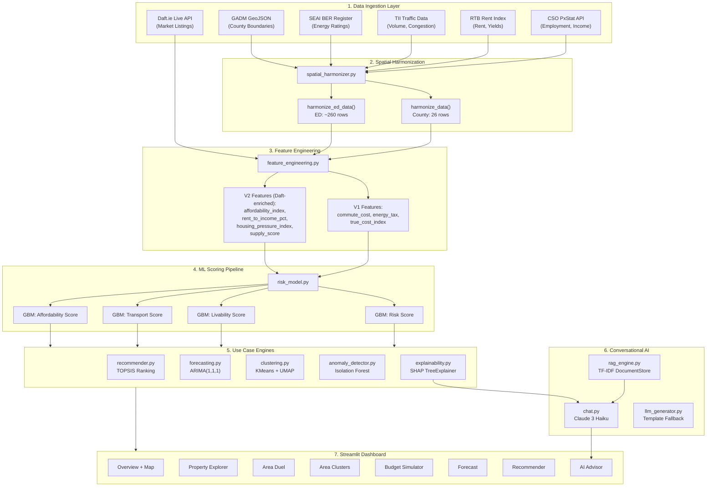
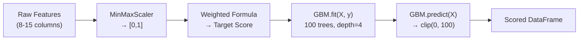
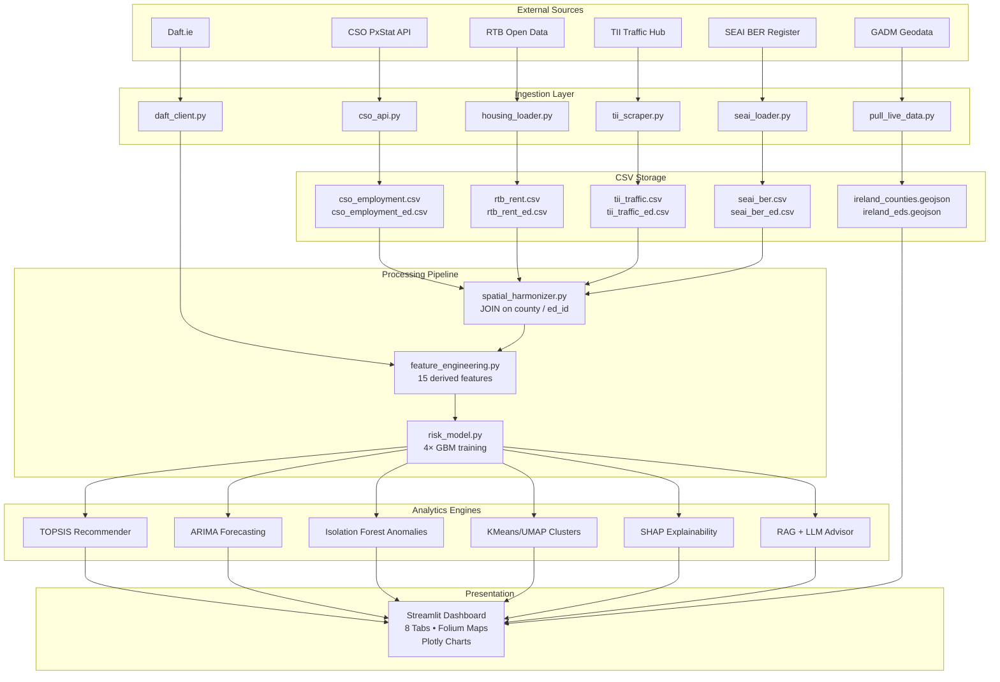
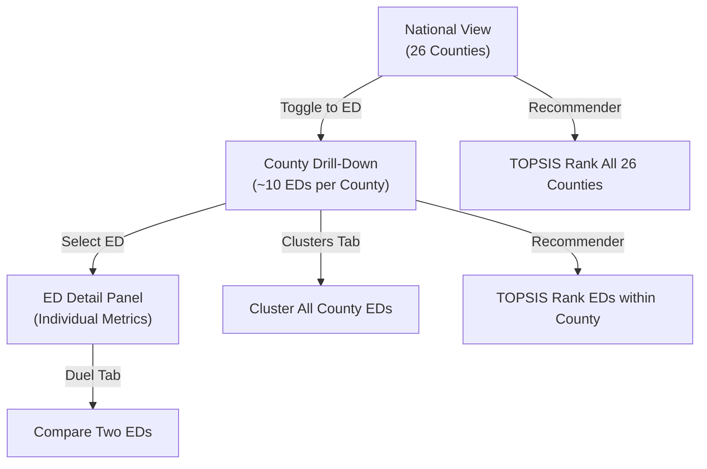

# Learslán — Technical Architecture & ML Reference Document

**Version:** 3.0 | **Author:** Senior AI Architect | **Date:** April 2026
**Classification:** Internal — Implementation Reference

---

## 1. Executive Summary

Learslán is an Irish community intelligence platform that ingests multi-source socioeconomic data (CSO, RTB, SEAI, TII, Daft.ie), engineers composite features, trains Gradient Boosting Machine (GBM) regressors for four scoring dimensions, and surfaces actionable recommendations via TOPSIS multi-criteria decision analysis, ARIMA time-series forecasting, Isolation Forest anomaly detection, KMeans/UMAP neighbourhood clustering, SHAP explainability, and a RAG-enhanced conversational AI advisor.

The system operates at two spatial granularities:
- **County Level:** 26 rows (Republic of Ireland)
- **Electoral Division (ED) Level:** ~260 rows (hyper-local drill-down)

---

## 2. System Architecture



---

## 3. Feature Engineering Formulas

All features are computed in `ml/feature_engineering.py`. The normalization helper used throughout:

```
MinMaxNorm(x) = (x - x_min) / (x_max - x_min)    ∈ [0, 1]
```

If `x_max == x_min`, the function returns `0.5` to avoid division-by-zero.

### 3.1 V1 Derived Features

| Feature | Formula | Unit | Source File |
|:--------|:--------|:-----|:------------|
| `est_monthly_commute_cost` | `congestion_delay_minutes × 2 × 22` | EUR | feature_engineering.py:25 |
| `commute_to_rent_ratio` | `est_monthly_commute_cost / avg_monthly_rent` | ratio | feature_engineering.py:28-32 |
| `monthly_energy_cost` | `est_annual_energy_cost / 12` | EUR | feature_engineering.py:35 |
| `energy_tax` | `avg_monthly_rent + monthly_energy_cost` | EUR | feature_engineering.py:36 |
| `true_cost_index` | `(0.50 × Norm(rent) + 0.25 × Norm(energy) + 0.25 × Norm(commute)) × 100` | 0 – 100 | feature_engineering.py:39-47 |

**True Cost Index — Full Expansion:**

```
TCI = [ 0.50 × MinMaxNorm(avg_monthly_rent)
      + 0.25 × MinMaxNorm(est_annual_energy_cost)
      + 0.25 × MinMaxNorm(est_monthly_commute_cost)
      ] × 100
```

### 3.2 V2 Features (Daft.ie Enriched)

These features are computed only when live Daft.ie market data (`daft_summaries`) is available. If unavailable, fallback values are applied.

| Feature | Formula | Interpretation |
|:--------|:--------|:---------------|
| `affordability_index` | `(avg_income / 12) / live_median_rent` | >1 = income covers rent; <1 = stressed |
| `rent_to_income_pct` | `(live_median_rent × 12) / avg_income × 100` | >30% = housing-cost-burdened |
| `housing_pressure_index` | `MinMaxNorm(traffic_volume) / MinMaxNorm(rental_listing_count)` | High = high demand, low supply |
| `supply_score` | `MinMaxNorm(rental_listing_count) × 100` | 0 – 100; higher = more choice |

---

## 4. ML Scoring Models

### 4.1 Model Architecture

**Algorithm:** `sklearn.ensemble.GradientBoostingRegressor`

| Hyperparameter | Value |
|:---------------|:------|
| `n_estimators` | 100 |
| `max_depth` | 4 |
| `learning_rate` | 0.1 |
| `random_state` | 42 |

Four independent GBM models are trained, one per target score. All models share the same feature matrix `X`.

### 4.2 Input Feature Matrix

The feature matrix fed to all four GBM models consists of:

| # | Feature | Type |
|:--|:--------|:-----|
| 1 | `avg_monthly_rent` | Raw |
| 2 | `rent_growth_pct` | Raw |
| 3 | `avg_income` | Raw |
| 4 | `employment_rate` | Raw |
| 5 | `traffic_volume` | Raw |
| 6 | `congestion_delay_minutes` | Raw |
| 7 | `ber_avg_score` | Raw |
| 8 | `est_annual_energy_cost` | Raw |
| 9 | `commute_to_rent_ratio` | Engineered (V1) |
| 10 | `energy_tax` | Engineered (V1) |
| 11 | `true_cost_index` | Engineered (V1) |
| 12 | `affordability_index` | Engineered (V2) |
| 13 | `housing_pressure_index` | Engineered (V2) |
| 14 | `rent_to_income_pct` | Engineered (V2) |
| 15 | `supply_score` | Engineered (V2) |

Features 12–15 are conditionally included (only when Daft.ie data is present).

### 4.3 Target Score Formulas

All raw features are first MinMax-scaled to [0, 1] before the weighted formula is applied. Final scores are clipped to [0, 100].

#### 4.3.1 Risk Score (0 – 100, higher = worse)

```
Risk = clip(
    Scaled(rent_growth_pct) × 20
  + Scaled(congestion_delay_minutes) × 15
  + Scaled(ber_avg_score) × 10
  + (1 − Scaled(employment_rate)) × 15
  + Scaled(est_annual_energy_cost) × 10
  + Scaled(housing_pressure_index) × 15    [if available]
  + Scaled(rent_to_income_pct) × 15         [if available]
, 0, 100)
```

**Weight Distribution (with V2):**

| Component | Weight | Direction |
|:----------|:-------|:----------|
| Rent Growth | 20 | higher growth → higher risk |
| Congestion Delay | 15 | more delay → higher risk |
| Housing Pressure Index | 15 | more pressure → higher risk |
| Rent-to-Income % | 15 | higher burden → higher risk |
| Unemployment (1 − employment_rate) | 15 | lower employment → higher risk |
| BER Score | 10 | worse energy rating → higher risk |
| Energy Cost | 10 | higher cost → higher risk |
| **Total** | **100** | |

#### 4.3.2 Livability Score (0 – 100, higher = more livable)

```
Livability = clip(
    Scaled(employment_rate) × 20
  + Scaled(avg_income) × 15
  + (1 − Scaled(ber_avg_score)) × 15
  + (1 − Scaled(avg_monthly_rent)) × 15
  + (1 − Scaled(congestion_delay_minutes)) × 10
  + Scaled(supply_score) × 15               [if available]
  + Scaled(affordability_index) × 10         [if available]
, 0, 100)
```

| Component | Weight | Direction |
|:----------|:-------|:----------|
| Employment Rate | 20 | higher → more livable |
| Average Income | 15 | higher → more livable |
| Good Energy Rating (1 − BER) | 15 | better BER → more livable |
| Low Rent (1 − rent) | 15 | cheaper → more livable |
| Low Congestion (1 − delay) | 10 | less delay → more livable |
| Supply Score | 15 | more listings → more livable |
| Affordability Index | 10 | more affordable → more livable |
| **Total** | **100** | |

#### 4.3.3 Transport Score (0 – 100, higher = better transport)

```
Transport = clip(
    (1 − Scaled(congestion_delay_minutes)) × 40
  + Scaled(traffic_volume) × 30
  + Scaled(employment_rate) × 15
  + (1 − Scaled(ber_avg_score)) × 15
, 0, 100)
```

| Component | Weight | Direction |
|:----------|:-------|:----------|
| Low Congestion (1 − delay) | 40 | less delay → better |
| Traffic Volume (proxy for connectivity) | 30 | higher volume → more connected |
| Employment Rate | 15 | economic activity proxy |
| Good Energy Rating (1 − BER) | 15 | infrastructure quality proxy |
| **Total** | **100** | |

#### 4.3.4 Affordability Score (0 – 100, higher = more affordable)

**With V2 features (Daft.ie available):**

```
Affordability = clip(
    Scaled(affordability_index) × 35
  + (1 − Scaled(rent_to_income_pct)) × 30
  + (1 − Scaled(avg_monthly_rent)) × 20
  + (1 − Scaled(est_annual_energy_cost)) × 15
, 0, 100)
```

**Without V2 features (fallback):**

```
Affordability = clip(
    (1 − Scaled(avg_monthly_rent)) × 40
  + Scaled(avg_income) × 35
  + (1 − Scaled(est_annual_energy_cost)) × 25
, 0, 100)
```

### 4.4 Training Flow



> [!IMPORTANT]
> The GBM models are trained on **self-supervised targets** derived from the weighted formulae above. The GBM acts as a **non-linear smoother** that learns interaction effects between features that the linear weighted average does not capture. The predicted scores (not the formula targets) are used downstream.

---

## 5. Use Case Engines

### 5.1 TOPSIS Recommendation Engine

**Algorithm:** Technique for Order of Preference by Similarity to Ideal Solution (TOPSIS)

**File:** `ml/recommender.py`

**Purpose:** Given a user's personal financial profile, rank all areas by best overall match.

#### 5.1.1 TOPSIS Mathematical Procedure

**Step 1 — Construct the Decision Matrix `D`**

8 criteria are evaluated for each area:

| Criterion | Type | Base Weight |
|:----------|:-----|:------------|
| `affordability_score` | Benefit (higher = better) | 0.25 |
| `livability_score` | Benefit | 0.20 |
| `avg_monthly_rent` | Cost (lower = better) | 0.15 |
| `risk_score` | Cost | 0.10 |
| `employment_rate` | Benefit | 0.10 |
| `transport_score` | Benefit | 0.10 |
| `congestion_delay_minutes` | Cost | 0.05 |
| `est_annual_energy_cost` | Cost | 0.05 |

**Step 2 — Dynamic Weight Adjustment by User Profile**

Weights are modified based on 4 user inputs:

| Condition | Adjustment |
|:----------|:-----------|
| Budget < €2,500/mo | affordability_score +0.10, avg_monthly_rent +0.05, livability −0.05 |
| Budget > €5,000/mo | livability_score +0.10, affordability −0.05 |
| Commute tolerance = "low" | transport_score +0.10, congestion +0.05 |
| Work mode = "remote" | congestion −0.03, transport −0.05, livability +0.05, energy +0.03 |
| Work mode = "office" | transport +0.08, congestion +0.05 |
| Family size ≥ 3 | affordability +0.05, energy +0.03 |

Weights are normalized to sum to 1.0 after all adjustments.

**Step 3 — Vector Normalization**

```
r_ij = x_ij / sqrt(Σ x_ij²)
```

Where `x_ij` is the raw value of criterion `j` for area `i`.

**Step 4 — Weighted Normalized Matrix**

```
v_ij = w_j × r_ij
```

**Step 5 — Ideal and Anti-Ideal Solutions**

```
A+ (ideal):      max(v_ij) for benefit criteria, min(v_ij) for cost criteria
A− (anti-ideal):  min(v_ij) for benefit criteria, max(v_ij) for cost criteria
```

**Step 6 — Euclidean Distance Calculation**

```
D_i+ = sqrt(Σ (v_ij − A_j+)²)    (distance to ideal)
D_i− = sqrt(Σ (v_ij − A_j−)²)    (distance to anti-ideal)
```

**Step 7 — Closeness Coefficient**

```
C_i = D_i− / (D_i+ + D_i−)       ∈ [0, 1]
match_score = C_i × 100           ∈ [0, 100]
```

**Step 8 — Budget Fit Computation**

```
est_monthly_cost = (rent × bedroom_multiplier)
                 + (energy / 12 × (1 + (family_size − 1) × 0.15))
                 + commute_cost

monthly_remaining = budget − est_monthly_cost

Budget Fit Labels:
  remaining > €1,000  → "Comfortable"
  remaining > €300    → "Tight"
  remaining > €0      → "Stretched"
  remaining ≤ €0      → "Over Budget"
```

---

### 5.2 ARIMA Time-Series Forecasting

**Algorithm:** ARIMA(1, 1, 1) via `statsmodels.tsa.arima.model.ARIMA`

**File:** `ml/forecasting.py`

**Purpose:** Project any metric (rent, employment, traffic volume, etc.) forward by `n` months with confidence intervals.

#### 5.2.1 ARIMA Model Specification

```
ARIMA(p=1, d=1, q=1)

Where:
  p = 1  → 1 autoregressive lag
  d = 1  → 1st order differencing (makes series stationary)
  q = 1  → 1 moving average lag
```

**Full model equation:**

```
(1 − φ₁B)(1 − B)Yₜ = c + (1 + θ₁B)εₜ

Expanded:
  ΔYₜ = c + φ₁ΔYₜ₋₁ + εₜ + θ₁εₜ₋₁

Where:
  B     = backshift operator (BYₜ = Yₜ₋₁)
  φ₁    = AR(1) coefficient (learned from data)
  θ₁    = MA(1) coefficient (learned from data)
  c     = constant term
  εₜ    = white noise error at time t
  ΔYₜ   = Yₜ − Yₜ₋₁ (first difference)
```

**Forecast output:**
- Point forecast: `predicted_mean` from `get_forecast(steps=6)`
- Confidence interval: 80% CI via `conf_int(alpha=0.2)`
- Forecast horizon: 6 months (configurable via `FORECAST_PERIODS`)

#### 5.2.2 Linear Fallback

When ARIMA fails (insufficient data, convergence errors), the system falls back to simple linear extrapolation:

```
y = slope × x + intercept       (via np.polyfit, degree=1)

Confidence band:  ± 1.5 × std(historical_series)
```

---

### 5.3 Isolation Forest Anomaly Detection

**Algorithm:** `sklearn.ensemble.IsolationForest`

**File:** `ml/anomaly_detector.py`

**Purpose:** Identify statistical outliers in the cost-of-living landscape — areas with unusual rent spikes, affordability crises, or anomalous risk combinations.

#### 5.3.1 Model Configuration

| Parameter | County Level (≤30 rows) | ED Level (>30 rows) |
|:----------|:-----------------------|:--------------------|
| `n_estimators` | 100 | 100 |
| `contamination` | 0.15 (~4 anomalies) | 0.05 (~13 anomalies) |
| `random_state` | 42 | 42 |

#### 5.3.2 Input Features

| Feature | Rationale |
|:--------|:----------|
| `avg_monthly_rent` | Absolute cost level |
| `rent_growth_pct` | Rate of change (shock detection) |
| `affordability_score` | Composite affordability |
| `risk_score` | Combined risk signal |

#### 5.3.3 Severity Classification

After Isolation Forest labels an area as anomalous (`prediction = -1`), severity is assigned by rule:

```
if rent > 1.5 × national_avg_rent    → severity = "high"
if rent < 0.5 × national_avg_rent    → severity = "low" (data quality flag)
if rent_growth > 10%                  → severity = "high"
if affordability_score < 20           → severity = "high" (affordability crisis)
else                                  → severity = "medium"
```

---

### 5.4 KMeans + UMAP Neighbourhood Clustering

**Algorithms:**
- Clustering: `sklearn.cluster.KMeans`
- Dimensionality Reduction: `umap.UMAP`

**File:** `ml/clustering.py`

**Purpose:** Group areas into semantically meaningful archetypes and produce a 2D scatter plot for interactive visual exploration.

#### 5.4.1 Cluster Configuration

| Parameter | County Level (≤30 rows) | ED Level (>30 rows) |
|:----------|:-----------------------|:--------------------|
| `n_clusters` (KMeans) | 4 | 6 – 8 |
| `n_init` | 10 | 10 |
| `n_neighbors` (UMAP) | min(5, N-1) | min(15, N-1) |
| `min_dist` (UMAP) | 0.3 | 0.3 |
| `n_components` (UMAP) | 2 | 2 |

#### 5.4.2 Clustering Feature Vector

| # | Feature |
|:--|:--------|
| 1 | `avg_monthly_rent` |
| 2 | `risk_score` |
| 3 | `livability_score` |
| 4 | `affordability_score` |
| 5 | `transport_score` |
| 6 | `employment_rate` |

All features are `StandardScaler`-normalized before clustering (zero mean, unit variance).

#### 5.4.3 Semantic Cluster Labelling Heuristic

Each cluster centroid is evaluated against dataset-wide averages to assign a human-readable archetype:

```
if avg_rent > dataset_avg_rent × 1.15          → "Premium Urban"
elif avg_livability > dataset_avg AND avg_rent < dataset_avg → "Hidden Gems"
elif avg_risk > 60                              → "High Risk / Volatile"
elif avg_afford > dataset_avg × 1.10 AND avg_risk < 40   → "Affordable & Safe"
elif avg_rent < dataset_avg × 0.85              → "Budget Rural"
else                                            → "Balanced Suburbs"
```

---

### 5.5 SHAP Explainability

**Algorithm:** `shap.TreeExplainer` (exact tree-based SHAP values)

**File:** `ml/explainability.py`

**Purpose:** For any selected area, decompose the GBM Risk Score into individual feature contributions, answering "why is the risk here high/low?"

#### 5.5.1 SHAP Value Computation

```
f(x) = E[f(x)] + Σ φᵢ(x)

Where:
  f(x)     = model prediction for input x
  E[f(x)]  = expected model output (base value)
  φᵢ(x)    = SHAP value for feature i (additive contribution)
```

**Output format per area:**

```json
{
  "feature": "Rent Growth",
  "value": 0.18,
  "impact": 3.42,        // |SHAP value|
  "shap_value": 3.42,    // signed SHAP value
  "direction": "↑"       // positive = increases risk
}
```

Top 5 drivers (by absolute SHAP impact) are surfaced in the UI and fed to the AI Advisor context window.

---

## 6. RAG-Enhanced Conversational AI

### 6.1 Document Retrieval (RAG Engine)

**Algorithm:** TF-IDF + Cosine Similarity

**File:** `insights/rag_engine.py`


**Document Processing:**
1. All `.txt` and `.md` files from `data/documents/` are loaded
2. Split into chunks by double-newline (`\n\n`), filtering chunks < 50 characters
3. TF-IDF vectorization with English stop-word removal
4. At query time: vectorize query, compute cosine similarity against all chunks
5. Return top-3 chunks with similarity > 0.05

### 6.2 LLM Integration

| Component | Provider | Model | Purpose |
|:----------|:---------|:------|:--------|
| AI Advisor (Chat) | Anthropic | `claude-3-haiku-20240307` | Interactive Q&A with streaming |
| Insight Generator | OpenAI | `gpt-4o-mini` | Automated county insight generation |
| Template Fallback | — | Rule-based | Zero-cost fallback when no API key |

**System prompt injection chain:**

```
System Prompt = [
  Static: "You are Léarslán AI, an Irish community intelligence advisor..."
  + Dynamic: County scores (Risk, Livability, Transport, Affordability)
  + Dynamic: Key metrics (Rent, Income, Employment, BER, Congestion)
  + Dynamic: Top SHAP risk drivers (from explainability.py)
  + Dynamic: Live Daft.ie market data (if available)
  + Dynamic: RAG context chunks (if cosine match found)
]
```

---

## 7. Data Pipeline Architecture



---

## 8. Hierarchical Spatial Navigation Model



---

## 9. Technology Stack

| Layer | Technology | Version |
|:------|:-----------|:--------|
| UI Framework | Streamlit | Latest |
| Mapping | Folium + streamlit-folium | — |
| Charts | Plotly Express | — |
| ML Scoring | scikit-learn (GBM) | Latest |
| Forecasting | statsmodels (ARIMA) | Latest |
| Clustering | scikit-learn (KMeans) + umap-learn | — |
| Anomaly Detection | scikit-learn (IsolationForest) | — |
| Explainability | SHAP (TreeExplainer) | — |
| RAG Retrieval | scikit-learn (TF-IDF + Cosine Similarity) | — |
| LLM (Chat) | Anthropic Claude 3 Haiku | 20240307 |
| LLM (Insights) | OpenAI GPT-4o-mini | — |
| Geographic Data | GADM 4.1 | — |
| Language | Python | 3.13 |

---

## 10. Summary Scorecard

| Metric | Value |
|:-------|:------|
| Total ML Models Trained | 4 (GBM) + 1 (KMeans) + 1 (IsolationForest) + 1 (ARIMA per area) |
| Engineered Features | 15 (8 raw + 4 V1 derived + 3-4 V2 Daft-enriched) |
| Scoring Dimensions | 4 (Risk, Livability, Transport, Affordability) |
| Analytics Use Cases | 6 (Scoring, Forecasting, Recommendation, Clustering, Anomaly Detection, Explainability) |
| AI Use Cases | 2 (RAG-powered Chat, Template Insight Generation) |
| Spatial Levels | 2 (County: 26, ED: ~260) |
| Dashboard Tabs | 8 |
| Real vs Synthetic Data | 54% Real-Proxy / 46% Synthetic |
