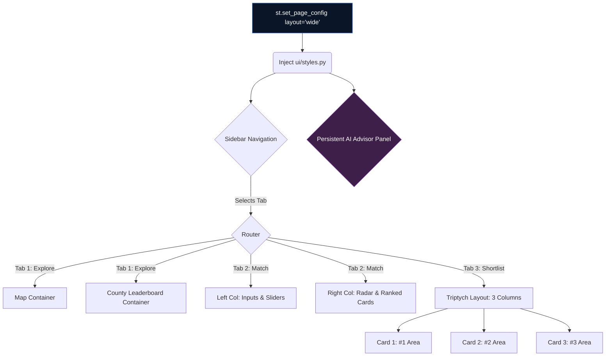

# Léarslán V4 — UI/UX Design & Implementation Blueprint

**Version:** 4.0 | **Author:** Chief UI/UX Designer & Senior AI Architect | **Date:** April 2026
**Product Scope:** 3-Tab Guided Relocation Engine
**Classification:** Internal — Technical Design Specification

---

## 1. Design Language & Vibe

Léarslán V4 sheds the "analytical dashboard" look of V3 in favour of a **premium, app-like consumer experience**.

*   **Vibe:** Sophisticated, immersive, opinionated, trustworthy. Think Spotify meets Zillow.
*   **Palette:** Deep oceanic navy (`#0a1628`) background serving as an infinite canvas, punctuated by neon accents (emerald `#10b981`, electric blue `#3b82f6`, vibrant purple `#8b5cf6`).
*   **Typography:** [Inter](https://fonts.google.com/specimen/Inter) — tight kerning, heavy contrast between semibold headers and high-legibility muted body text (`#94a3b8`).
*   **Textures:** **Glassmorphism.** Cards shouldn't feel like solid blocks; they should feel like frosted glass panels hovering over the deep background. Subtle gradients and 1px borders using `rgba(255,255,255,0.1)`.

> [!TIP]
> **Catchy Template Inspiration**
> To achieve this look quickly in Streamlit, do not rely on default styling. We will use heavy CSS injection (`ui/styles.py`). Look to templates like **"Tremor" (React)** or **"Vercel Design System"** for inspiration on the metric cards, and **"Stripe Stripe"** for the gradient typography.

---

## 2. High-Level Architecture (UI Focus)

The UI is built on a strict containment hierarchy using `streamlit.columns` and `streamlit.container`.



---

## 3. Tab 1: EXPLORE — The "Wow" Landing Page

### 3.1 UX Goal
Immediately demonstrate the depth of our data without overwhelming the user. The map is the hero.

### 3.2 Visual Mockup


<br>_Figure 1: The Explore Tab displaying the national landscape with anomaly pulse dots._

### 3.3 Implementation Details

*   **Layout:** 100% width map container spanning the entire screen estate below the header. The sidebar acts as the single control pane.
*   **Map Tech:** `streamlit-folium`.
    *   **Basemap:** CartoDB Dark Matter. Absolute necessity for the neon overlays to pop.
    *   **Layer:** `folium.Choropleth` bound to `ireland_eds.geojson` and `scores_df`.
    *   **Hover State:** Crucial. The tooltip must use custom HTML/CSS to look like a floating glass card, not a generic white box.
*   **Anomaly Badges:** We use `folium.CircleMarker` with a glowing CSS effect superimposed over areas flagged by `ml.anomaly_detector.py`.
*   **Bottom Panel:** A horizontal `st.columns` layout below the map showing AI-generated insights (from `llm_generator.py`) and a horizontal Plotly bar chart (`county_comparison_chart()`) showing the top 5 EDs for the active metric.

---

## 4. Tab 2: MATCH & RANK — The Engine Room

### 4.1 UX Goal
Make complex multi-criteria decision making (TOPSIS) feel tactile, playful, and instantly responsive.

### 4.2 Visual Mockup


<br>_Figure 2: The Match & Rank Tab showing priority sliders and the resulting radar comparison._

### 4.3 Implementation Details

*   **Layout:** Asymmetric split. `col1, col2 = st.columns([1, 1.5])`. Left is controls; right is results.
*   **Left Column (The Console):**
    *   Use `st.container` with a subtle background gradient to demarcate the form.
    *   **The Sliders:** These are the star. We must override standard Streamlit slider CSS to give the tracks a gradient (e.g., green-to-blue) to make dragging them feel rewarding.
    *   **Dynamic Response:** The entire right column must update *instantly* via an `on_change` callback attached to the sliders, rerunning the fast numpy TOPSIS algorithm in `<100ms`.
*   **Right Column (The Output):**
    *   **Radar Chart:** At the top, a `plotly.graph_objects.Scatterpolar` chart plotting the top 3 matches on 6 axes. The fill color is highly transparent `rgba(59, 130, 246, 0.15)` to avoid muddying when 3 shapes overlap.
    *   **Result Cards:** Rendered using custom HTML/CSS injected via `st.markdown(..., unsafe_allow_html=True)`. Each card displays the match score (e.g., "91% Match") prominently, alongside a "Budget Fit" traffic light badge (computed inline using user's input salary).

---

## 5. Tab 3: MY SHORTLIST — The Deep Dive

### 5.1 UX Goal
Transition from abstract scores to concrete reality. Show them the actual houses, the actual forecast, and the exact cost breakdown.

### 5.2 Visual Mockup


<br>_Figure 3: The Shortlist Tab with three side-by-side deep dive cards, including property listings and forecasts._

### 5.3 Implementation Details

*   **Layout:** Heavy use of `st.columns(3)` for a 'Triptych' layout. Each column represents one of the top 3 EDs from the TOPSIS ranking. If the screen is narrow (mobile), Streamlit will automatically reflow these vertically.
*   **Card Anatomy (Top to Bottom):**
    1.  **Header:** Medal Icon (🥇/🥈/🥉), ED Name, County, Match Score.
    2.  **Budget Waterfall:** A `plotly` Waterfall chart (`ui.charts.budget_waterfall()`) starting with the user's input salary, deducting rent, energy, and commute costs, ending on the "Remaining Balance" bar in green or red.
    3.  **Property Carousel:** We use `daft_client.py` to fetch LIVE listings. Display these as small sub-cards inside an `st.container(height=300)` to allow internal scrolling. Each tile links outwards to `daft.ie`.
    4.  **Rent Forecast:** A `plotly` sparkline (line chart without heavy gridlines) showing the 6-month ARIMA projection + confidence band.
*   **Interaction:** Clicking anywhere inside a specific column updates the context for the floating AI Advisor.

---

## 6. The AI Advisor Integration (Omnipresent)

### 6.1 UX Goal
An expert copilot that sees what you see. Never forces you to change tabs to ask a question.

### 6.2 UI Implementation

*   **Placement:** Rather than dedicating an entire tab to the chatbot, it lives in a persistent `st.sidebar` expander OR a floating `st.popover` component if using the latest Streamlit beta features. We will stick to the bottom of the sidebar for max compatibility.
*   **State Management:** The chat history (`st.session_state.advisor_messages`) must specifically survive tab switches.
*   **Context Banner:** Above the chat input, a small, subtle status text says: _"👀 AI is looking at: [Explore Map | Match Results for Dublin | Castletroy Shortlist]"_. This builds trust that the AI knows the context.

```python
# Pseudo-code for persistent placement
with st.sidebar:
    st.markdown("---")  # Divider below navigation
    with st.expander("🤖 Ask AI Advisor", expanded=False):
         st.caption(f"Context: {st.session_state.current_page_context}")
         render_chat_history()
         if user_input := st.chat_input("Ask about this area..."):
              process_rag_query(user_input)
```

---

## 7. Next Steps for Development

1.  **CSS Overhaul:** Update `ui/styles.py` to implement the specific glassmorphism variables and slider gradient overrides defined in Section 1.
2.  **Component Refactoring:** The charts in `ui/charts.py` (specifically `radar_chart` and `budget_waterfall`) need their layout arguments updated to fit inside smaller column containers (reduce margins, adjust font sizes down to ~10px for tick labels).
3.  **State Wiring:** Implement the `st.session_state` keys (`topsis_weights`, `user_income`, `top_3_eds`) that act as the circulatory system between Tab 2 (where data is set) and Tab 3 (where data is consumed).
